# Spring Documentation MCP Server

> ⚠️ **Disclaimer**
>
> This is **NOT** an official Spring or Spring Boot project and is **NOT** part of the Spring ecosystem.
>
> This project is created for **educational purposes only**, similar to my other demo applications that showcase architecture patterns and Spring Boot OSS features.
>
> **Code Authorship**: This service was written using [Claude Code](https://claude.ai/claude-code) as the code author.
>
> **Purpose**: My main goal is to create demo applications using my own specifications to explore AI-assisted development workflows.

### (Current Version 1.5.4 - Collapsible Sidebar Menu & Version Sync Fix)

A comprehensive Spring Boot application that serves as a Model Context Protocol (MCP) Server, providing AI assistants with full-text searchable access to Spring ecosystem documentation via Server-Sent Events (SSE).

## What is this?

This MCP server enables AI assistants (like Claude) to search, browse, and retrieve Spring Framework documentation, code examples, and API references. It includes:

- **MCP Server**: SSE-based protocol implementation using Spring AI
- **Documentation Sync**: Automated synchronization from spring.io and GitHub spring-projects repositories
- **Full-Text Search**: PostgreSQL-powered search across all Spring documentation
- **Web Management UI**: Thymeleaf-based interface for managing projects, versions, and documentation
- **Code Examples**: Searchable repository of Spring code snippets
- **Migration Recipes**: OpenRewrite-based migration knowledge for Spring Boot version upgrades
- **Language Evolution**: Java (8+) and Kotlin (1.6+) feature tracking with deprecations and code patterns
- **Flavors**: Company-specific guidelines, architecture patterns, compliance rules, and AI agent configurations
- **Flavor Groups**: Team-based access control with API key membership for secure guideline sharing
- **Boot Initializr**: Spring Initializr integration for dependency search, compatibility checks, and formatted snippets
- **Javadoc API Docs**: Crawled and indexed Javadoc documentation for Spring projects with full-text search

## Table of Contents

- [What is this?](#what-is-this)
- [Changelog](#changelog)
- [Quick Start](#quick-start)
- [API Key Authentication](#api-key-authentication)
- [Features](#features)
  - [Dashboard & Project Management](#dashboard--project-management)
  - [Documentation Management](#documentation-management)
  - [Code Examples](#code-examples)
  - [Migration Recipes](#migration-recipes)
  - [Language Evolution](#language-evolution)
  - [Flavors - Company Guidelines](#flavors---company-guidelines)
  - [Flavor Groups - Team Access Control](#flavor-groups---team-access-control)
  - [Boot Initializr Integration](#boot-initializr-integration)
  - [Javadoc API Documentation](#javadoc-api-documentation)
  - [MCP Monitoring Dashboard](#mcp-monitoring-dashboard)
- [Using with Claude Code](#using-with-claude-code)
  - [Configuration](#mcp-configuration)
  - [Documentation Queries](#documentation-queries)
  - [Migration Planning](#migration-planning)
  - [Language Evolution Queries](#language-evolution-queries)
  - [Company Guidelines & Flavors](#company-guidelines--flavors)
  - [Boot Initializr Queries](#boot-initializr-queries)
  - [Javadoc API Queries](#javadoc-api-queries)
- [Configuration](#configuration)
- [Troubleshooting](#troubleshooting)
- [Roadmap](#roadmap)
- [Contributing](#contributing)
- [License](#license)
- [Resources](#resources)

## Changelog

> **Full changelog**: See [CHANGELOG.md](CHANGELOG.md) for detailed version history.

### Recent Releases

| Version   | Date       | Highlights                                                   |
|-----------|------------|--------------------------------------------------------------|
| **1.5.4** | 2025-12-25 | Collapsible sidebar menu, SNAPSHOT → GA version sync fix     |
| **1.5.3** | 2025-12-19 | User display name, Spring Boot 3.5.9                         |
| **1.5.2** | 2025-12-17 | JEP/KEP specs, detail pages, getLanguageFeatureExample tool  |
| **1.5.1** | 2025-12-17 | Javadoc MCP tools transaction rollback fix                   |
| **1.5.0** | 2025-12-16 | MCP Monitoring Dashboard with real-time metrics and analytics |
| **1.4.3** | 2025-12-12 | Javadoc sync version filter, login version, flavor groups fix |
| **1.4.2** | 2025-12-08 | Javadoc API documentation crawler and search (4 MCP tools)   |
| **1.4.1** | 2025-12-07 | GitHub docs keyword fix, configurable sync features          |
| **1.4.0** | 2025-12-06 | Boot Initializr integration, Caffeine caching (5 MCP tools)  |
| **1.3.4** | 2025-12-05 | Spring AI 1.1.1, CVE-2025-48924 security fix                 |
| **1.3.3** | 2025-12-04 | Flavor Groups with team-based access control (3 MCP tools)   |
| **1.3.2** | 2025-12-02 | YAML metadata headers for Flavors import/export, new example |
| **1.3.1** | 2025-12-01 | GitHub documentation scanner, enhanced code examples         |
| **1.3.0** | 2025-11-30 | Flavors feature (8 MCP tools)                                |
| **1.2.0** | 2025-11-29 | Language Evolution tracking (6 MCP tools)                    |
| **1.1.0** | 2025-11-28 | OpenRewrite migration recipes (7 MCP tools)                  |
| **1.0.2** | 2025-11-27 | Spring Boot 3.5.8, example app                               |
| **1.0.1** | 2025-11-26 | Initial release (10 MCP tools)                               |

**MCP Tools**: 10 (docs) + 7 (migration) + 7 (language) + 8 (flavors) + 3 (groups) + 5 (initializr) + 4 (javadocs) = **44 total**

## Quick Start

### Prerequisites

**IMPORTANT**: This project requires **Java 25** (LTS).

```bash
# Install Java 25 with SDKMAN (recommended)
curl -s "https://get.sdkman.io" | bash
sdk install java 25.0.1-tem
sdk use java 25.0.1-tem

# Verify
java -version  # Should show: openjdk version "25"
```

### 1. Start PostgreSQL Database
```bash
docker-compose up -d postgres
```

### 2. Build and Run
```bash
./gradlew clean build
java -jar build/libs/spring-boot-documentation-mcp-server-1.5.4.jar
```

Or using Gradle:
```bash
./gradlew bootRun
```

### 3. Access the Application

- **Web UI**: http://localhost:8080
- **Login**: Username: `admin`, Password: `admin`
- **MCP SSE Endpoint**: http://localhost:8080/mcp/spring/sse

## API Key Authentication

The MCP endpoints are protected by secure API key authentication.

<table>
  <tr>
    <td width="100%">
      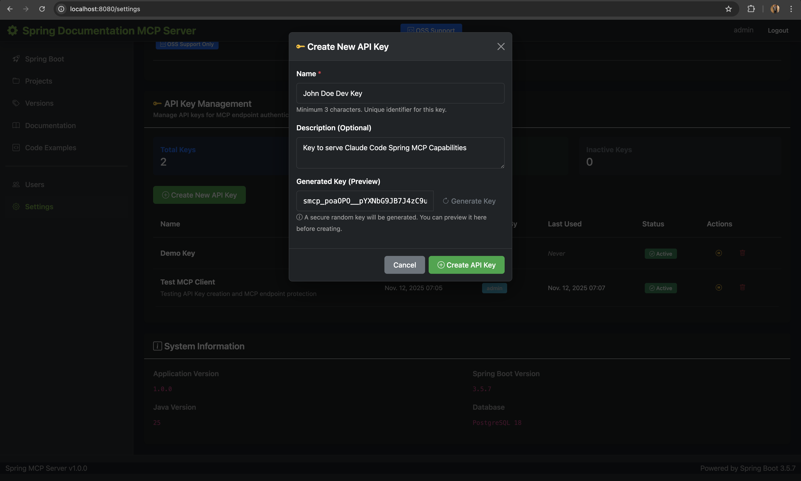
      <p align="center"><b>API Key Management</b> - Secure key generation with activation controls and confirmation modals</p>
    </td>
  </tr>
</table>

### Creating an API Key

1. **Log in to the Web UI** at http://localhost:8080 (Username: `admin`, Password: `admin`)
2. **Navigate to Settings** (`/settings`)
3. **Scroll to "API Key Management"** section
4. **Click "Create New API Key"** button
5. **Enter details**: Name (minimum 3 characters) and optional description
6. **Copy the API key immediately** - it will only be shown once!

**API Key Format**: `smcp_<secure-random-string>` (256-bit cryptographically secure, BCrypt hashed)

### Using API Keys

API keys can be provided in three ways:

1. **X-API-Key Header** (Recommended):
   ```bash
   curl -H "X-API-Key: smcp_your_key_here" http://localhost:8080/mcp/spring/sse
   ```

2. **Authorization Bearer Header**:
   ```bash
   curl -H "Authorization: Bearer smcp_your_key_here" http://localhost:8080/mcp/spring/sse
   ```

3. **Query Parameter** (Testing only):
   ```bash
   curl "http://localhost:8080/mcp/spring/sse?api_key=smcp_your_key_here"
   ```

---

## Features

### Dashboard & Project Management

The dashboard provides an overview of all synchronized Spring projects, versions, and documentation with quick access to management functions.

<table>
  <tr>
    <td width="50%">
      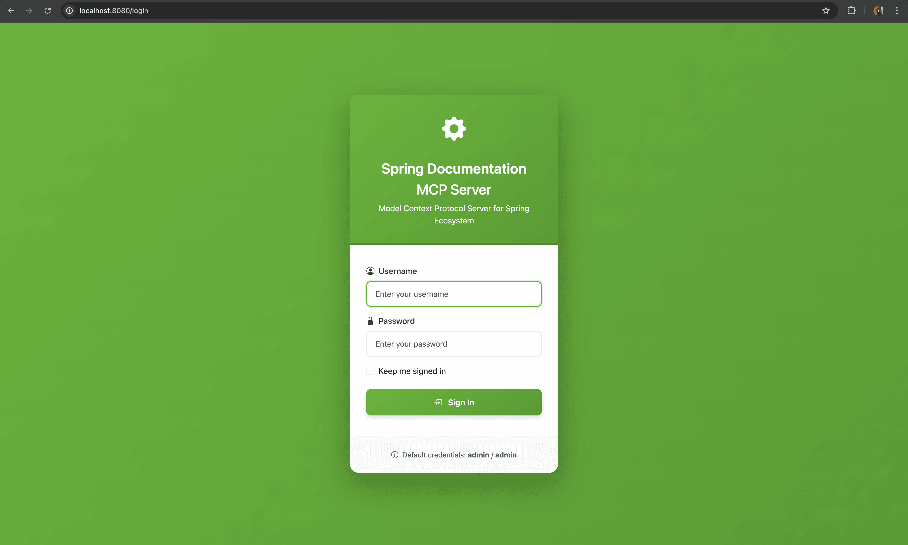
      <p align="center"><b>Login</b> - Secure authentication with Spring Security</p>
    </td>
    <td width="50%">
      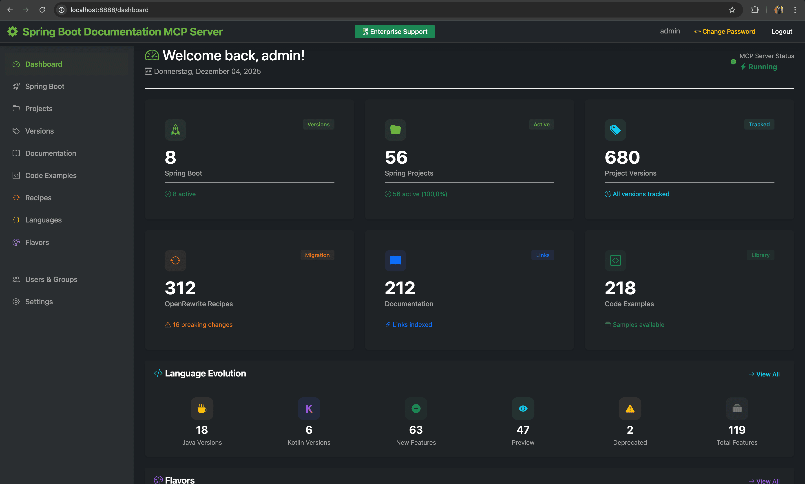
      <p align="center"><b>Dashboard</b> - Overview statistics and quick actions</p>
    </td>
  </tr>
  <tr>
    <td width="50%">
      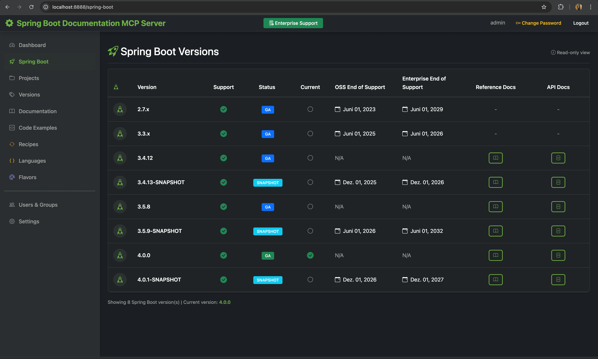
      <p align="center"><b>Spring Boot</b> - Spring Boot project management</p>
    </td>
    <td width="50%">
      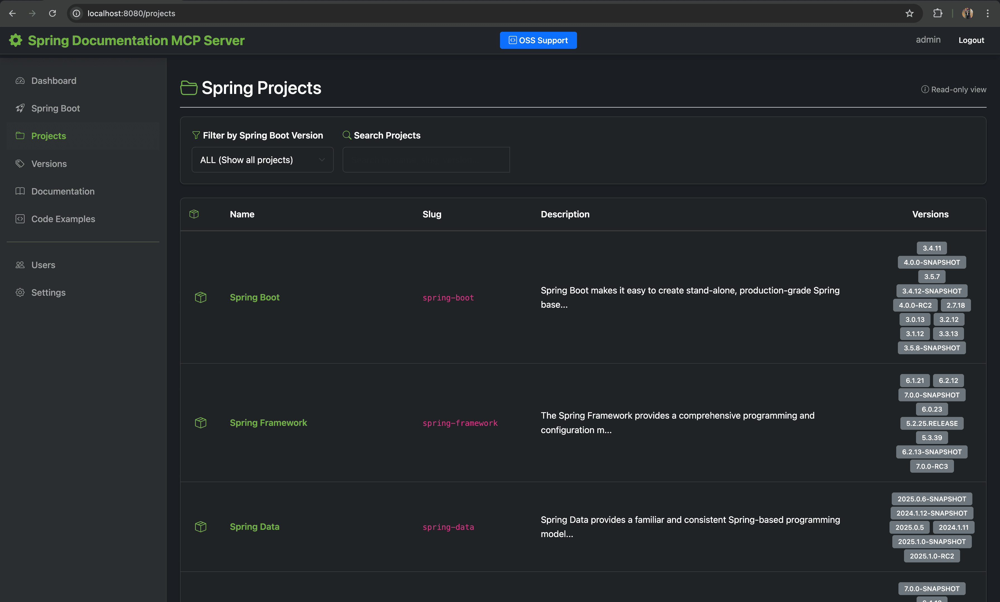
      <p align="center"><b>Projects</b> - All Spring projects overview</p>
    </td>
  </tr>
</table>

**Web UI Features**:
- **Dashboard**: Overview statistics, recent updates, and quick actions
- **Projects**: Manage Spring projects (Boot, Framework, Data, Security, Cloud, etc.)
- **Versions**: Version management with latest/default marking and EOL tracking
- **Users**: User management with role-based access (Admin, User, ReadOnly)
- **Settings**: Application configuration, scheduler settings, feature toggles

---

### Documentation Management

Comprehensive documentation synchronization from spring.io and GitHub repositories with full-text search capabilities.

<table>
  <tr>
    <td width="50%">
      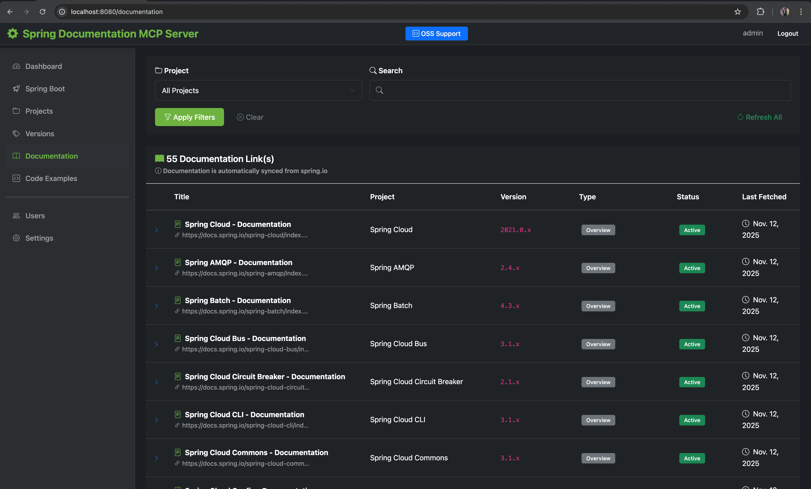
      <p align="center"><b>Documentation</b> - Full-text search and browse with filters</p>
    </td>
    <td width="50%">
      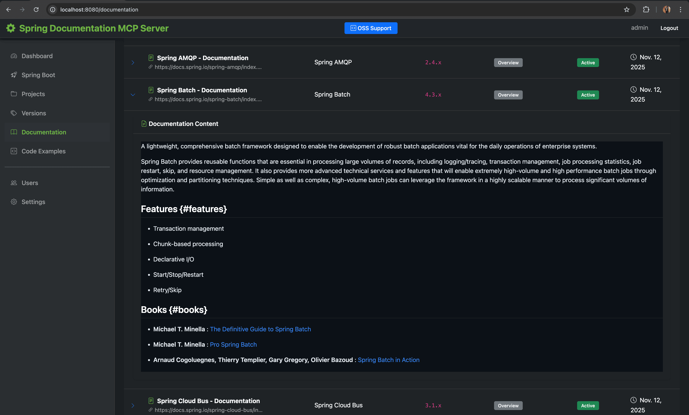
      <p align="center"><b>Markdown Content</b> - Expanded documentation with syntax highlighting</p>
    </td>
  </tr>
  <tr>
    <td width="50%">
      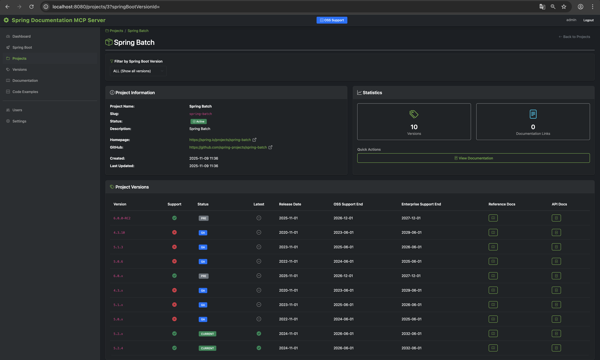
      <p align="center"><b>Project Details</b> - Spring Batch project with version list</p>
    </td>
    <td width="50%">
      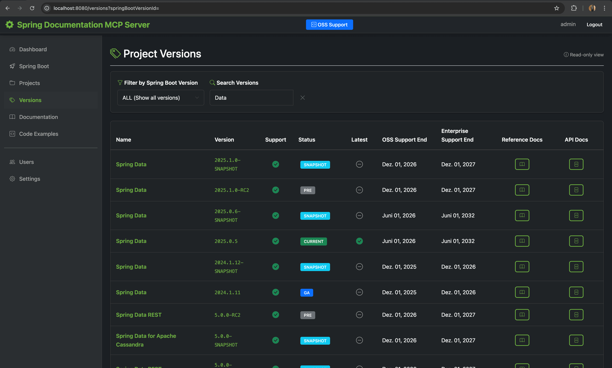
      <p align="center"><b>Versions</b> - Version management with state tracking</p>
    </td>
  </tr>
</table>

**Features**:
- **Spring.io Sync**: Crawls spring.io/projects to discover projects and documentation
- **GitHub Source Docs**: Direct AsciiDoc fetching from spring-projects repositories
- **Version Detection**: Automatic version tracking with tag resolution
- **Full-Text Search**: PostgreSQL tsvector with relevance ranking
- **Scheduled Updates**: Configurable cron-based synchronization

---

### Code Examples

A searchable repository of Spring code snippets with syntax highlighting and organization by topic.

<table>
  <tr>
    <td width="100%">
      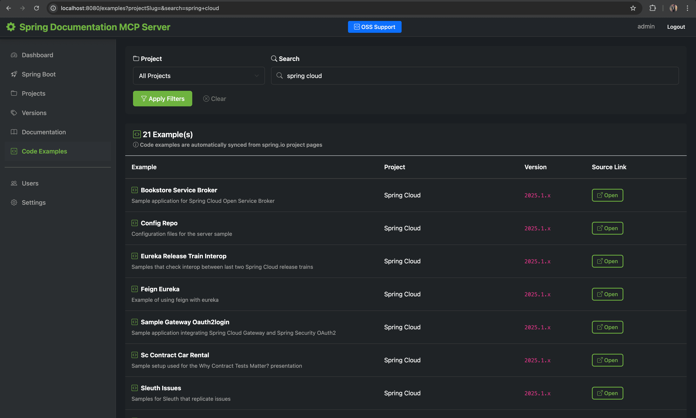
      <p align="center"><b>Code Examples</b> - Searchable code snippets library with language and category filters</p>
    </td>
  </tr>
</table>

**Features**:
- **Rich Code Snippets**: Complete examples with syntax highlighting (Atom One Dark theme)
- **Topic Grouping**: Organized by category (Configuration, REST API, Data Access, Security)
- **Code View Modal**: Click-to-view with copy-to-clipboard functionality
- **Language Support**: Java, Kotlin, Groovy, XML, YAML, and more
- **Tag System**: Multiple tags per example for enhanced discoverability
- **Version Association**: Link examples to specific Spring project versions

---

### Migration Recipes

OpenRewrite-inspired migration knowledge for upgrading between Spring ecosystem versions. This is an **optional feature** that can be enabled or disabled.

<table>
  <tr>
    <td width="100%">
      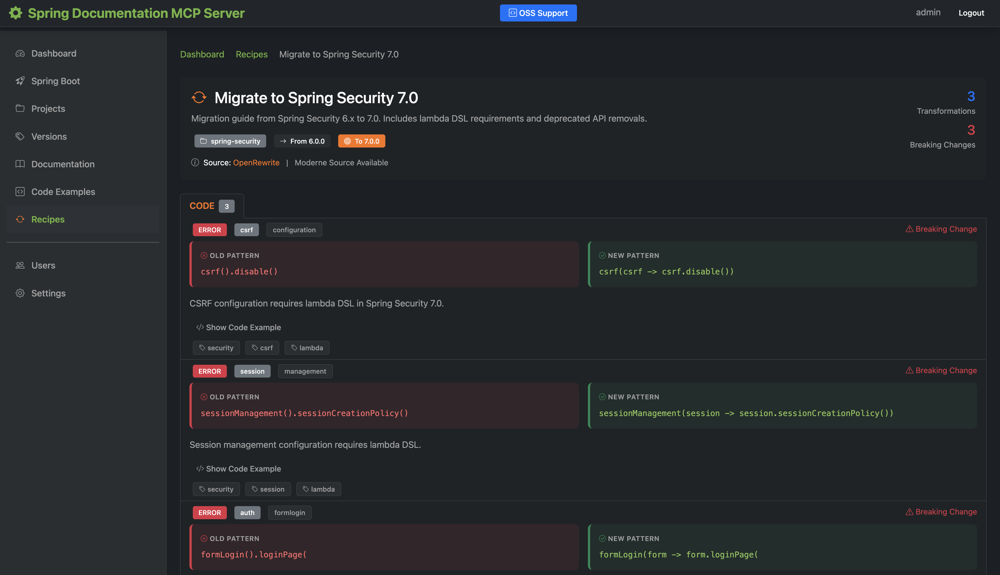
      <p align="center"><b>Migration Recipes</b> - Transformations with before/after code patterns</p>
    </td>
  </tr>
</table>

**Features**:
- **Dynamic Recipe Generation**: Automatically generated based on Spring projects in database
- **Version Upgrade Paths**: Migrations between consecutive major.minor versions
- **Transformation Types**: Dependencies, imports, properties, annotations, and code changes
- **55+ Spring Projects**: Supports all major Spring ecosystem projects
- **Breaking Changes**: Severity levels (CRITICAL, ERROR, WARNING, INFO)

**Configuration**:
```yaml
mcp:
  features:
    openrewrite:
      enabled: true  # Set to false to disable
```

---

### Language Evolution

Comprehensive tracking of Java (8+) and Kotlin (1.6+) language changes with deprecations, removals, and code pattern examples.

<table>
  <tr>
    <td width="50%">
      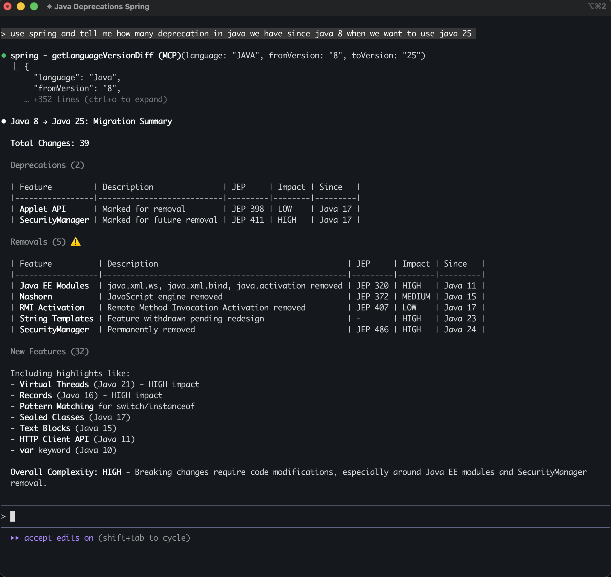
      <p align="center"><b>JDK Deprecations</b> - Claude Code querying Java deprecations since JDK 8</p>
    </td>
    <td width="50%">
      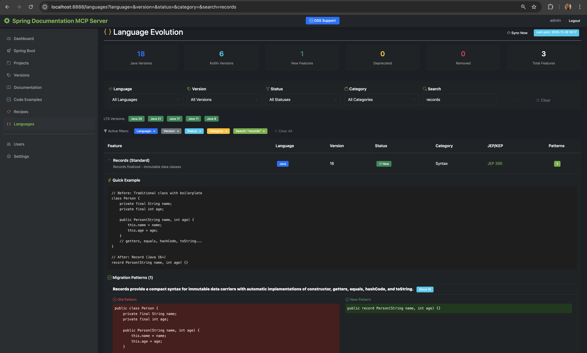
      <p align="center"><b>Language Evolution</b> - Java Records code pattern example</p>
    </td>
  </tr>
</table>

**Features**:
- **Version Tracking**: All Java versions from 8 onwards, Kotlin from 1.6 onwards
- **Feature Status**: NEW, DEPRECATED, REMOVED, PREVIEW, INCUBATING
- **JEP/KEP Tracking**: Links to Java Enhancement Proposals and Kotlin Evolution Proposals
- **Code Patterns**: Old vs new code examples showing how to modernize code
- **Spring Boot Compatibility**: Which Java/Kotlin versions are required for each Spring Boot version
- **Version Comparison**: Compare features between two versions

**Configuration**:
```yaml
mcp:
  features:
    language-evolution:
      enabled: true  # Set to false to disable
```

---

### Flavors - Company Guidelines

A flexible system for managing company-specific guidelines, architecture patterns, compliance rules, AI agent configurations, and project initialization templates.

<table>
  <tr>
    <td width="50%">
      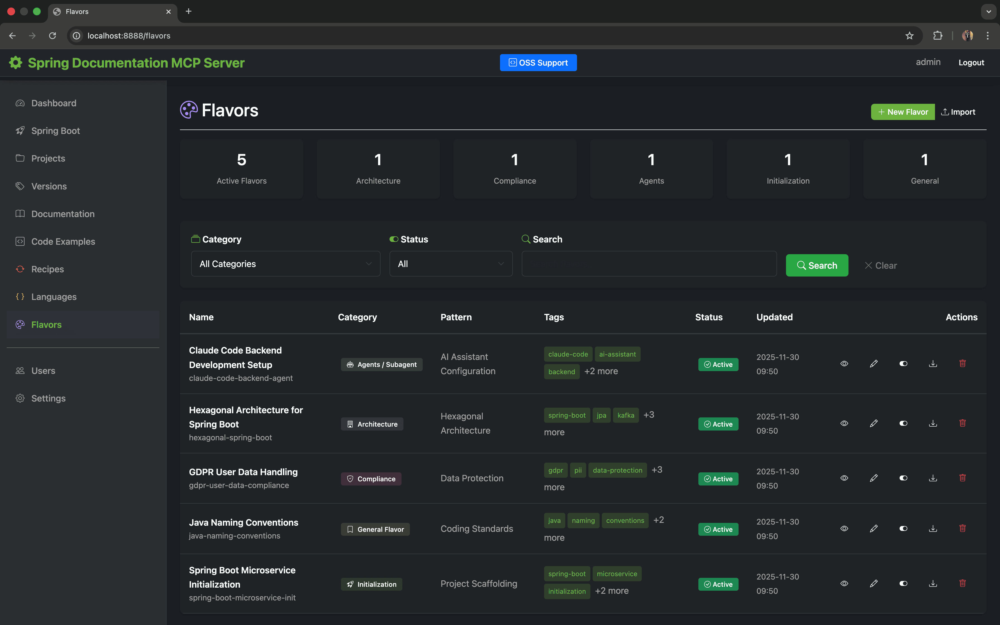
      <p align="center"><b>Flavors</b> - Company guidelines with category filtering</p>
    </td>
    <td width="50%">
      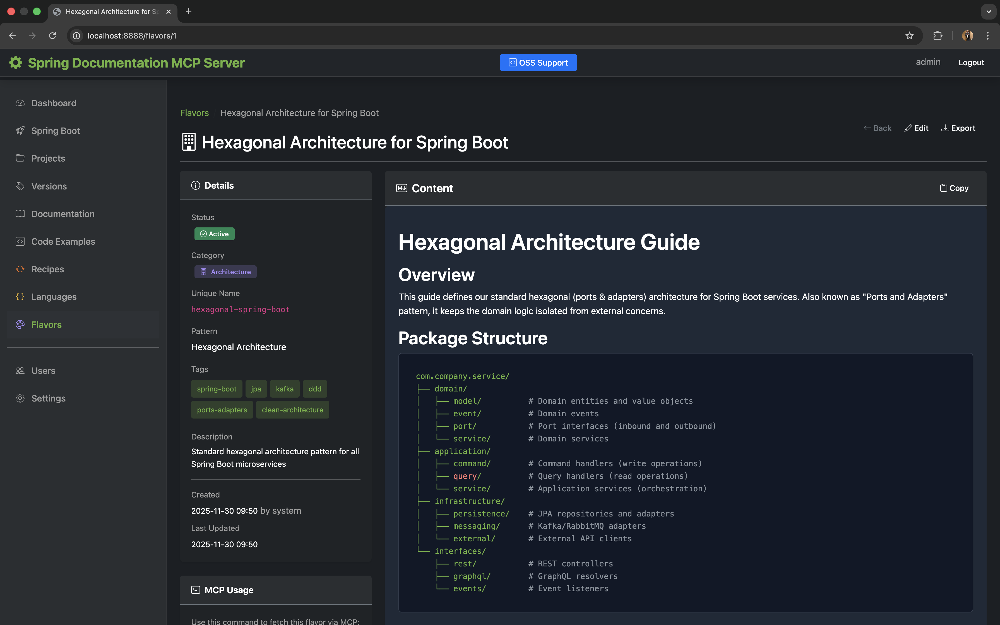
      <p align="center"><b>Flavor Details</b> - Hexagonal Architecture pattern with markdown content</p>
    </td>
  </tr>
</table>

**Categories**:
- **Architecture**: Design patterns (hexagonal, microservices, event-driven)
- **Compliance**: Regulatory requirements (GDPR, SOC2, HIPAA, PCI-DSS)
- **Agents**: AI agent configurations and prompts for specific tasks
- **Initialization**: Project setup templates and bootstrapping guides
- **General**: Coding standards and best practices

**Features**:
- **Markdown Content**: Rich content with full-text search
- **Import/Export with YAML Metadata**: Share flavors via markdown files with YAML front matter
- **Category Filtering**: Quick access by category
- **8 MCP Tools**: AI assistants can query flavor data for context-aware assistance

**YAML Front Matter Format**:
```markdown
---
unique-name: my-flavor-identifier
display-name: My Flavor Display Name
category: ARCHITECTURE
pattern-name: Optional Pattern Name
description: Brief description
tags: tag1, tag2, tag3
---

# Actual Markdown Content Here
...
```

---

### Flavor Groups - Team Access Control

Team-based organization and API key-based access control for secure sharing of guidelines with specific teams while keeping public standards available to everyone.

<table>
  <tr>
    <td width="50%">
      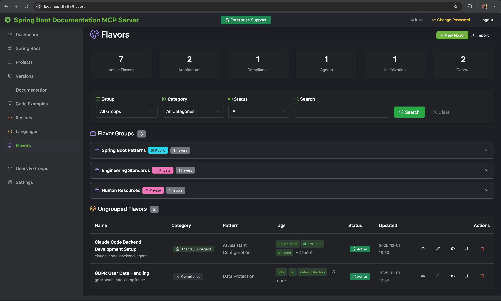
      <p align="center"><b>Flavor Groups</b> - Team-based organization with public/private visibility</p>
    </td>
    <td width="50%">
      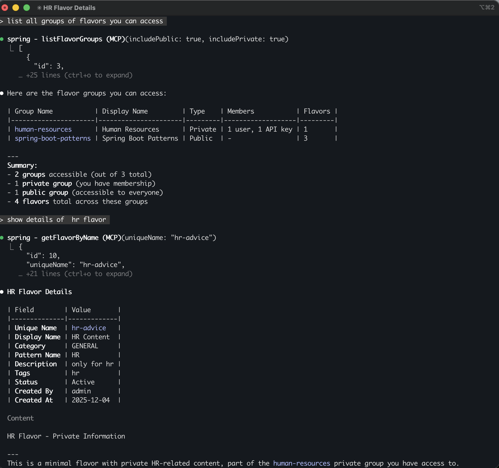
      <p align="center"><b>Claude Code Integration</b> - AI assistant accessing HR department guidelines</p>
    </td>
  </tr>
</table>

**Core Concepts**:

1. **Public Groups**: Groups without members - visible to everyone
   - Use for organization-wide standards (e.g., "Company Coding Standards")
   - All API keys can access public groups

2. **Private Groups**: Groups with API key members - restricted visibility
   - Only member API keys can see and access the group
   - Use for team-specific guidelines (e.g., "HR Policies", "Security Guidelines")

3. **Active/Inactive Status**: Inactive groups are completely hidden

**Security Model**:
```
MCP Request → API Key Validation → Security Context → Group Membership Check → Access Granted/Denied
```

**Setting Up Groups**:

1. **Create Groups** (Web UI → Groups → New):
   - Enter unique name (lowercase, hyphens only)
   - Set display name and description
   - Choose active status

2. **Add API Key Members** (Web UI → Groups → Edit):
   - Check the API keys that should be members
   - Private groups require at least one member
   - Public groups should have no members

3. **Assign Flavors** (Web UI → Flavors → Edit):
   - Check/uncheck groups to assign the flavor
   - A flavor can belong to multiple groups

**Best Practices**:
- Use meaningful group names: `payment-team`, `security-guidelines`, `frontend-standards`
- Document group purposes with clear descriptions
- Create separate API keys for different teams/environments
- Monitor API key last-used timestamps in Settings

---

### Boot Initializr Integration

Direct integration with [start.spring.io](https://start.spring.io) for project generation and dependency management.

<table>
  <tr>
    <td width="50%">
      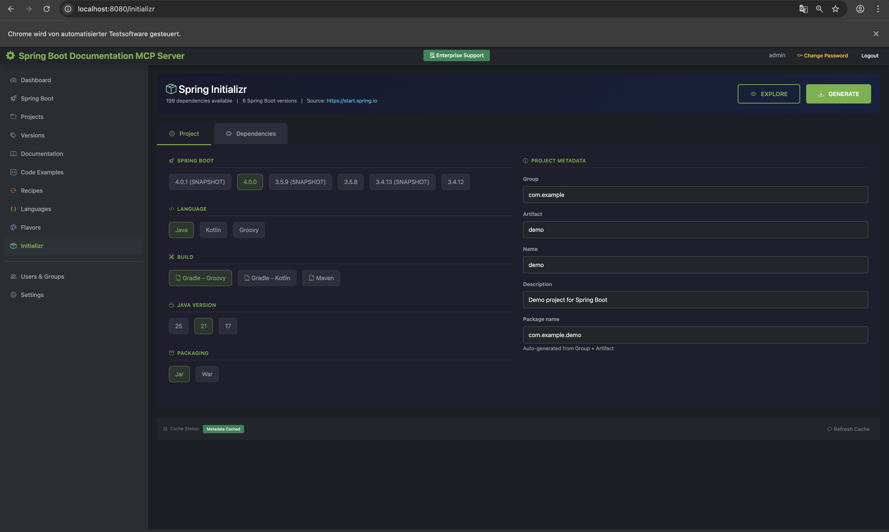
      <p align="center"><b>Boot Initializr</b> - Project generation with two-tab design for configuration and dependencies</p>
    </td>
    <td width="50%">
      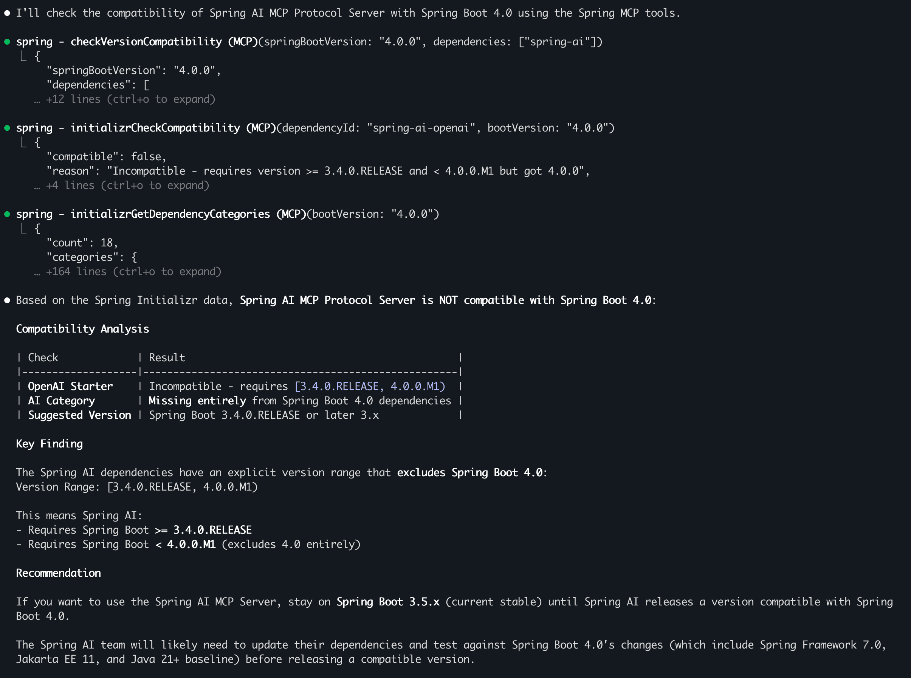
      <p align="center"><b>Compatibility Check</b> - Claude verifying Spring AI MCP compatibility with Spring Boot 4.0</p>
    </td>
  </tr>
</table>

**Features**:
- **Two-Tab Interface**: Project configuration and dependency selection in organized tabs
- **Live Dependency Search**: Real-time search across all Spring Boot starters
- **Build File Preview**: Preview generated pom.xml or build.gradle before download
- **Version Selection**: Choose from stable, RC, and snapshot Spring Boot versions
- **Caffeine Caching**: High-performance caching with configurable TTL
- **Version Compatibility Filtering**: Automatically filters incompatible dependencies based on Spring Boot version
- **Incompatibility Warnings**: Modal alerts when selected dependencies become incompatible after version change
- **5 MCP Tools**: AI assistants can search dependencies, check compatibility, and more

**MCP Tools**:
- `initializrGetDependency` - Get dependency with Maven/Gradle snippet (checks version compatibility)
- `initializrSearchDependencies` - Search dependencies by name/description (filters by bootVersion)
- `initializrCheckCompatibility` - Check dependency version compatibility
- `initializrGetBootVersions` - List available Spring Boot versions
- `initializrGetDependencyCategories` - Browse dependencies by category (filters by bootVersion)

**Configuration**:
```yaml
mcp:
  features:
    initializr:
      enabled: true              # Set to false to disable
      base-url: https://start.spring.io
      cache:
        enabled: true
        metadata-ttl: 60m        # Metadata cache TTL
        dependencies-ttl: 30m    # Dependencies cache TTL
      defaults:
        boot-version: "3.5.8"
        java-version: "21"
        language: "java"
```

---

### Javadoc API Documentation

Comprehensive Javadoc crawling, indexing, and search for Spring project APIs. This feature downloads and parses Javadoc HTML from Spring project documentation sites, storing structured class, method, field, and constructor information.

<table>
  <tr>
    <td width="50%">
      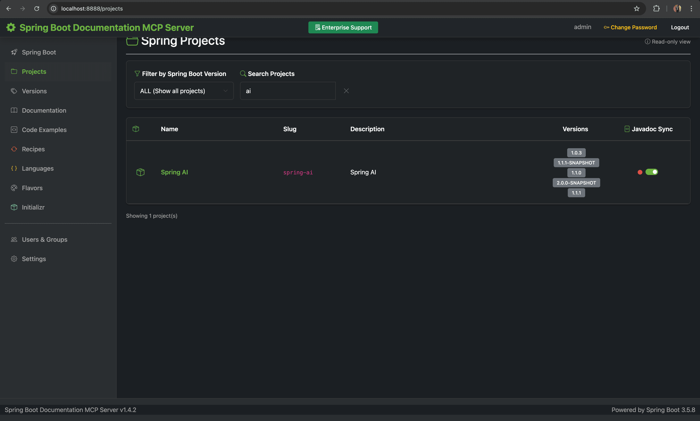
      <p align="center"><b>Enable Javadoc Sync</b> - Projects page with sync toggle for Spring AI</p>
    </td>
    <td width="50%">
      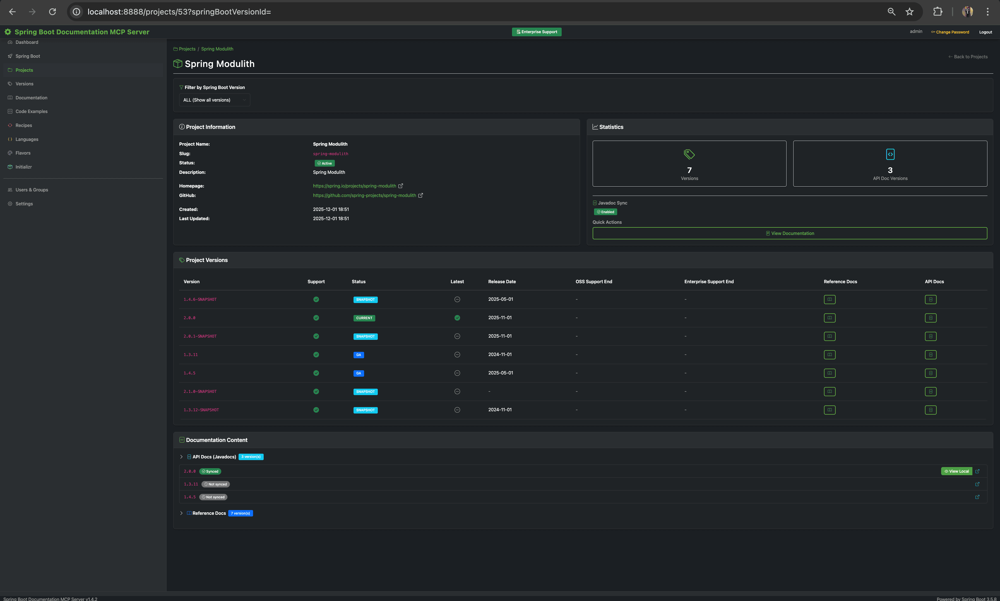
      <p align="center"><b>Sync Complete</b> - Javadoc viewer with indexed classes and methods</p>
    </td>
  </tr>
  <tr>
    <td width="50%">
      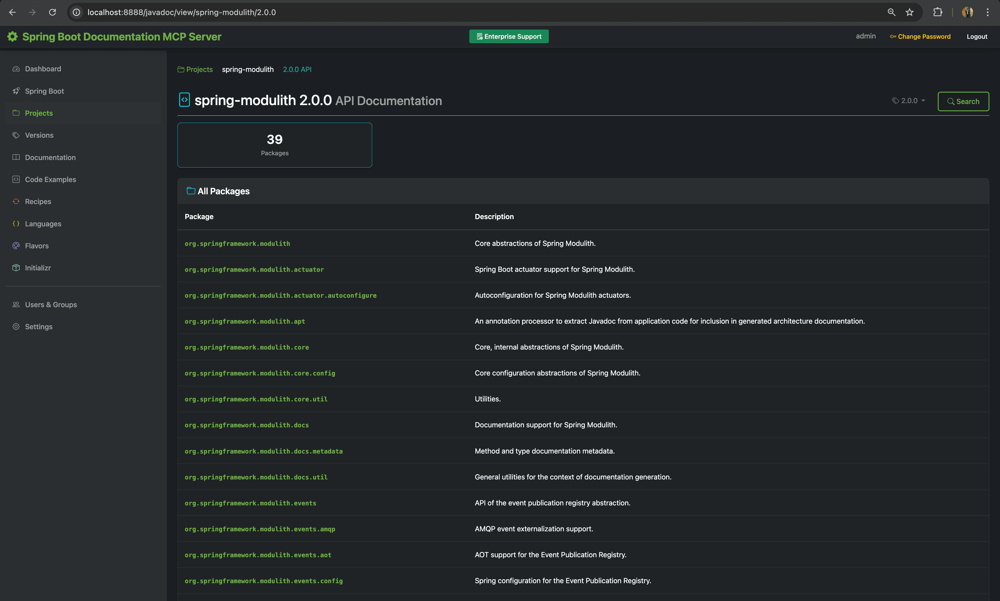
      <p align="center"><b>Spring Modulith API</b> - API Documentation of Spring Modulith 2.0.0</p>
    </td>
    <td width="50%">
      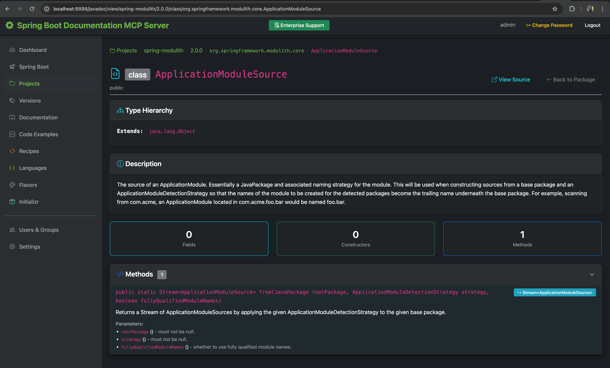
      <p align="center"><b>Class Details</b> - ApplicationModuleSource from Spring Modulith 2.0.0</p>
    </td>
  </tr>
</table>

**Features**:
- **Automated Crawling**: Discovers and parses Javadoc HTML from docs.spring.io
- **Structured Storage**: Packages, classes, methods, fields, constructors stored in PostgreSQL
- **Full-Text Search**: PostgreSQL tsvector search across all Javadoc content
- **Version Awareness**: Track multiple versions per library with latest version resolution
- **Per-Project Toggle**: Enable/disable sync for each Spring project individually
- **Project Detail Integration**: View synced Javadocs directly from the project detail page (`/projects/{id}`)
- **Local Javadoc Viewer**: Browse packages, classes, methods, and fields with syntax highlighting
- **Sync Page Integration**: Phase 9 card for manual Javadoc synchronization
- **4 MCP Tools**: AI assistants can query API documentation

#### Enabling Javadoc Sync for a Project

To enable Javadoc synchronization for a Spring project:

1. **Navigate to Projects**: Go to the Projects page (`/projects`)
2. **Filter Projects**: Use the search filter to find the project (e.g., "Spring AI")
3. **Enable Sync Toggle**: Click the "Enable Javadoc Sync" toggle switch in the project row
4. **Wait for Sync**: The system will crawl and index the Javadocs for all versions with API doc URLs

> ⚠️ **Important**: Javadoc synchronization is a resource-intensive operation. Each Spring project can have multiple versions, and each version contains hundreds of packages and thousands of classes. **A single project sync can take 30 minutes to over 1 hour** depending on the project size and network conditions.

#### Sync Behavior

- **Rate Limiting**: The crawler uses a 230ms delay between requests to avoid overwhelming the server
- **Batch Processing**: Classes are processed in batches with configurable limits
- **Failure Handling**: After 5 consecutive failures, sync is automatically disabled for the project
- **Scheduled Sync**: By default, enabled projects sync weekly on Sunday at 4 AM
- **Manual Sync**: Use the Sync page (`/sync`) → Phase 9 "Javadocs" card to trigger manual sync

#### Javadoc Version Filter (v1.4.3)

By default, only **GA (General Availability)** and **CURRENT** versions are synchronized. Pre-release versions can be optionally included via Settings:

1. **Navigate to Settings** (`/settings`)
2. **Find "Javadoc Sync Version Filter"** section
3. **Toggle filters**:
   - **SNAPSHOT**: Include development builds (e.g., `2.0.0-SNAPSHOT`)
   - **RC**: Include release candidates (e.g., `1.0.0-RC1`, `1.0.0-RC2`)
   - **Milestone (M)**: Include milestone releases (e.g., `1.0.0-M1`, `1.0.0-M2`)

> **Tip**: Keeping pre-release versions disabled reduces sync time and storage usage. Enable them only if you need to reference upcoming API changes in your documentation.

**Example**: For Spring AI with versions `1.1.2` (GA), `2.0.0-SNAPSHOT`, `2.0.0-M1`, `1.0.3`:
- With all filters disabled: Only `1.1.2` and `1.0.3` are synced
- With SNAPSHOT enabled: Adds `2.0.0-SNAPSHOT`
- With Milestone enabled: Adds `2.0.0-M1`

#### What Gets Indexed

For each Spring project version with an API doc URL:
- **Packages**: All Java packages with descriptions
- **Classes/Interfaces/Enums**: Full class documentation including:
  - Class description and deprecation status
  - Inheritance hierarchy (extends/implements)
  - Annotations
- **Methods**: All public methods with:
  - Signatures and return types
  - Parameter descriptions
  - Throws declarations
- **Fields**: Static and instance fields with types
- **Constructors**: All public constructors with parameters

**MCP Tools**:
- `getClassDoc`: Get full class documentation including methods, fields, constructors
- `getPackageDoc`: Get package documentation with list of classes/interfaces
- `searchJavadocs`: Full-text search across all Javadoc content
- `listJavadocLibraries`: List all libraries with available versions

**Configuration**:
```yaml
mcp:
  features:
    javadocs:
      enabled: true              # Set to false to disable entire feature
      sync:
        enabled: true            # Enable/disable scheduled sync
        schedule: "0 0 4 * * SUN"  # Weekly on Sunday at 4 AM
        max-failures: 5          # Auto-disable after consecutive failures
        rate-limit-ms: 500       # Delay between HTTP requests
        batch-size: 50           # Classes per batch
      parser:
        connection-timeout-ms: 10000
        read-timeout-ms: 30000
        max-classes-per-package: 500
        max-methods-per-class: 200
```

---

### MCP Monitoring Dashboard

Real-time monitoring and analytics for MCP server operations, providing insights into tool usage, connection events, and performance metrics.

<table>
  <tr>
    <td width="50%">
      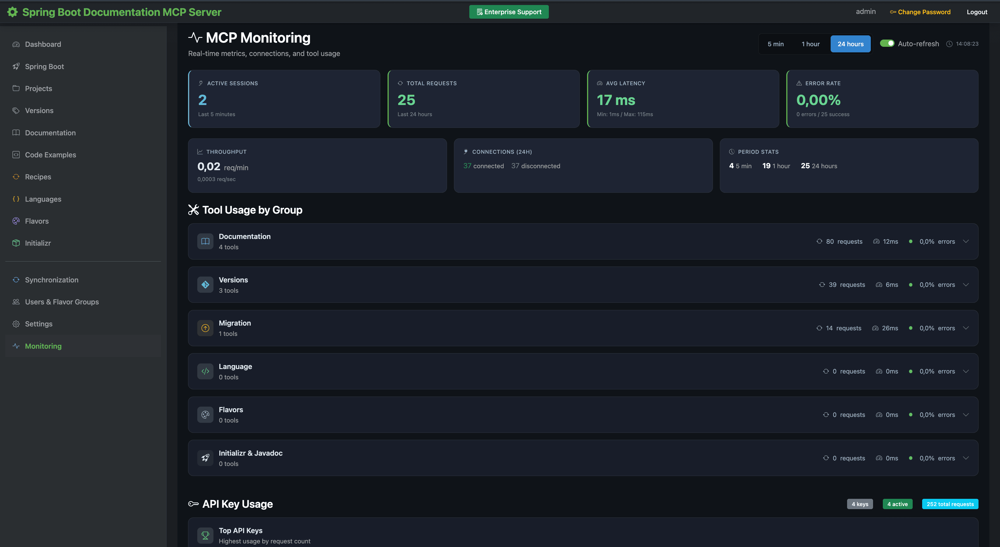
      <p align="center"><b>Monitoring Dashboard</b> - Real-time tool usage metrics with time period selection</p>
    </td>
  </tr>
</table>

**Features**:
- **Real-Time Metrics**: Live dashboard with auto-refresh (configurable interval)
- **Time Period Selection**: View metrics for 5 minutes, 1 hour, or 24 hours
- **Tool Usage by Group**: Metrics organized by tool categories (Documentation, Versions, Migration, Language, Flavors, Initializr/Javadoc)
- **Performance Tracking**: Average, min, max latency per tool with success/error rates
- **Connection Monitoring**: Active connections, connection events, and error tracking
- **API Key Usage**: Request counts per API key with last-used timestamps
- **Client Usage Statistics**: Top clients by connection count
- **Data Retention**: Configurable retention period with manual cleanup option

**Dashboard Sections**:
- **Overview Cards**: Total requests, active connections, latency metrics, error rates
- **Tool Usage by Group**: Expandable groups showing individual tool metrics
- **API Key Usage**: Top 5 API keys by request count
- **Client Usage**: Top clients accessing the MCP server
- **Settings**: Auto-refresh interval and data retention configuration

**Access**:
Navigate to `/monitoring` (requires ADMIN role) to access the dashboard.

---

## Using with Claude Code

Configure Claude Code to use the Spring Documentation MCP Server for AI-assisted development.

### MCP Configuration

Add to your Claude Code MCP configuration (`.mcp.json`):

```json
{
  "mcpServers": {
    "spring": {
      "type": "sse",
      "url": "http://localhost:8080/mcp/spring/sse",
      "headers": {
        "X-API-Key": "YOUR_API_KEY_HERE"
      }
    }
  }
}
```

Replace `YOUR_API_KEY_HERE` with your actual API key from the Settings page, then restart Claude Code.

### Documentation Queries

Use natural language to search Spring documentation:

```
> use spring to search for autoconfiguration in Spring Boot 3.5

> use spring to list all Spring projects and show me which ones support messaging

> use spring to get the latest Spring Boot 3.5 version with all documentation links

> use spring to find code examples for REST controllers in Java
```

**Available Documentation Tools**:
- Search across all Spring documentation with filters
- List available versions for any Spring project
- Browse all Spring projects by use case
- Get documentation for specific versions
- Search code examples with language/project filters

### Migration Planning

Get migration assistance when upgrading Spring versions:

```
> use spring to show me how to migrate from Spring Boot 3.3 to 3.5

> use spring to find all breaking changes in Spring Boot 4.0

> use spring to check if spring-security and flyway are compatible with Spring Boot 4.0

> use spring to search for MockBean replacement in Spring Boot 4.0 migrations

> use spring to find the replacement for deprecated Health.status() method
```

**Available Migration Tools**:
- Get comprehensive migration guides between versions
- List breaking changes with severity levels
- Search migration knowledge base
- Check dependency compatibility
- Find deprecation replacements

### Language Evolution Queries

Query Java and Kotlin language evolution:

```
> use spring to show me all Java versions and their LTS status

> use spring to list new features in Java 21

> use spring to show what changed between Java 17 and Java 21

> use spring to find all deprecated features since Java 8

> use spring to get the Java version requirements for Spring Boot 3.5.9

> use spring to search for pattern matching features in Java
```

**Available Language Tools**:
- List all Java/Kotlin versions with feature counts
- Get features by version with status filtering
- Compare features between two versions
- Get old vs new code patterns for modernization
- Check Spring Boot language requirements

### Company Guidelines & Flavors

Access company-specific guidelines and patterns:

```
> use spring to search for hexagonal architecture guidelines

> use spring to list all architecture patterns for microservices

> use spring to get our GDPR compliance rules

> use spring to show the AI agent configuration for code reviews

> use spring to get the project initialization template for Spring Boot microservices
```

**With Team-Based Access** (Flavor Groups):

```
> use spring to list all flavor groups I have access to

> use spring to get all guidelines from the engineering-standards group

> use spring to show me the payment-team architecture patterns
  (only accessible if your API key is a member of the payment-team group)

> use spring to get the HR department policies
  (requires membership in the hr-policies private group)
```

**Available Flavor Tools**:
- Search guidelines with full-text search
- Get complete flavor content by name
- List flavors by category
- Get architecture patterns for specific technologies
- Get compliance rules by framework
- List accessible flavor groups
- Get all flavors in a specific group

### Boot Initializr Queries

Get dependency information and project setup assistance:

```
> use spring to search for database dependencies in Spring Boot

> use spring to get the spring-data-jpa dependency for my Gradle project

> use spring to check if graphql is compatible with Spring Boot 3.3.0

> use spring to list all available Spring Boot versions

> use spring to show all dependencies in the Security category

> use spring to show AI dependencies compatible with Spring Boot 3.5.9

> use spring to list all dependency categories for Spring Boot 4.0.1
```

**Available Initializr Tools**:
- Get dependencies with formatted Maven/Gradle snippets
- Search dependencies by name or description (with version filtering)
- Check compatibility with specific Spring Boot versions
- List available Spring Boot versions (stable, RC, snapshot)
- Browse dependency categories (with version-based filtering)

**Version Compatibility**:
The Initializr tools automatically filter dependencies based on Spring Boot version compatibility:
- AI dependencies (Spring AI) require Spring Boot 3.x (not compatible with 4.0 until Spring AI 2.0 GA)
- Some cloud dependencies have specific version requirements
- Use `initializrCheckCompatibility` to verify before adding dependencies

**Team Configuration Example**:

Different teams can use different API keys to access their specific groups:

```json
// Engineering Team - .mcp.json
{
  "mcpServers": {
    "spring": {
      "type": "sse",
      "url": "http://localhost:8080/mcp/spring/sse",
      "headers": {
        "X-API-Key": "smcp_engineering_team_key"
      }
    }
  }
}

// Security Team - .mcp.json
{
  "mcpServers": {
    "spring": {
      "type": "sse",
      "url": "http://localhost:8080/mcp/spring/sse",
      "headers": {
        "X-API-Key": "smcp_security_team_key"
      }
    }
  }
}
```

### Javadoc API Queries

Query Spring API documentation directly:

```
> use spring to get the documentation for RestTemplate class

> use spring to search javadocs for WebClient

> use spring to list all available javadoc libraries

> use spring to get the package documentation for org.springframework.web.client

> use spring to show me the methods in the JdbcTemplate class
```

**Available Javadoc Tools**:
- Get full class documentation with methods, fields, constructors
- Get package documentation with list of classes
- Full-text search across all indexed Javadocs
- List available libraries and versions

---

## Configuration

### Environment Variables

```bash
# Database
export DB_HOST=localhost
export DB_PORT=5432
export DB_NAME=spring_mcp
export DB_USER=postgres
export DB_PASSWORD=postgres

# Security
export ADMIN_USER=admin
export ADMIN_PASSWORD=changeme

# Server
export SERVER_PORT=8080

# Bootstrap
export BOOTSTRAP_DOCS=false  # Set to true for sample data
```

### GitHub Token Configuration (Recommended)

The GitHub sync features fetch documentation from Spring repositories. Without a token, GitHub limits you to **60 requests/hour**, which can cause `429 Too Many Requests` errors during sync. With a token, you get **5,000 requests/hour**.

#### Creating a GitHub Personal Access Token

1. Go to [GitHub Settings → Tokens](https://github.com/settings/tokens)
2. Click **"Generate new token (classic)"**
3. Give it a name like `spring-mcp-server`
4. Select scope: **`public_repo`** (read-only access to public repositories)
5. Click **"Generate token"**
6. Copy the token immediately (you won't see it again)

#### Using the Token

**Option 1: Environment Variable (temporary)**
```bash
export GITHUB_TOKEN=ghp_your_token_here
./gradlew bootRun
```

**Option 2: .env File (recommended for development)**
```bash
# Copy the example file
cp .env.example .env

# Edit .env and add your token
GITHUB_TOKEN=ghp_your_token_here

# Source and run
source .env && ./gradlew bootRun
```

**Option 3: Docker Compose**
```yaml
# In docker-compose.yml or docker-compose-all.yaml
environment:
  GITHUB_TOKEN: ${GITHUB_TOKEN}
```

Then run: `GITHUB_TOKEN=ghp_your_token_here docker-compose up`

> **Security Note:** Never commit your token to version control. The `.env` file is already in `.gitignore`.

### Application Configuration

Key configuration in `src/main/resources/application.yml`:

```yaml
spring:
  ai:
    mcp:
      server:
        name: "spring-documentation-server"
        sse-endpoint: /mcp/spring/sse
        sse-message-endpoint: /mcp/spring/messages

mcp:
  features:
    openrewrite:
      enabled: true       # Migration recipes
    language-evolution:
      enabled: true       # Java/Kotlin tracking
    flavors:
      enabled: true       # Company guidelines & groups
    initializr:
      enabled: true       # Boot Initializr integration

  documentation:
    fetch:
      enabled: true
      schedule: "0 0 2 * * ?"  # Daily at 2 AM
```

---

## Troubleshooting

### Java Version Issues

```bash
java -version        # Verify Java 25
echo $JAVA_HOME      # Ensure JAVA_HOME points to Java 25
```

### Database Connection Issues

```bash
docker-compose ps
docker-compose logs postgres
psql -h localhost -U postgres -d spring_mcp  # Password: postgres
```

### Build Issues

```bash
./gradlew clean build --refresh-dependencies
```

### Port Already in Use

```bash
lsof -ti :8080 | xargs kill -9
```

### MCP Connection Issues

1. **Verify application is running**:
   ```bash
   curl http://localhost:8080/actuator/health
   ```

2. **Check MCP endpoint with API key**:
   ```bash
   curl -H "X-API-Key: your_api_key" http://localhost:8080/mcp/spring/sse
   ```

3. **Test with MCP Inspector**:
   ```bash
   npx @modelcontextprotocol/inspector
   ```
   Configure with URL: `http://localhost:8080/mcp/spring/sse` and your API key header.

---

## Roadmap

### Completed
- [x] Spring Boot 3.5.9 with Spring AI 1.1.2 MCP Server
- [x] PostgreSQL database with full-text search
- [x] 43 MCP tools (documentation, migration, language, flavors, groups, initializr, javadocs)
- [x] Web management UI with all features
- [x] API Key authentication with BCrypt encryption
- [x] Documentation sync from spring.io and GitHub
- [x] Code examples repository
- [x] OpenRewrite migration recipes
- [x] Language Evolution tracking (Java/Kotlin)
- [x] Flavors with YAML import/export
- [x] Flavor Groups with team-based access control
- [x] Boot Initializr integration with Caffeine caching
- [x] Javadoc API documentation crawler and search
- [x] Export features (Markdown)
- [x] Analytics and usage tracking
- [x] MCP Monitoring Dashboard with real-time metrics

### Planned
- [ ] Semantic search using embeddings
- [ ] Version comparison and diff
- [ ] Air-Gapped Replication Mode

---

## Contributing

This is a demonstration/reference MCP server implementation. Contributions are welcome!

Areas for contribution:
- Additional Spring project coverage
- Enhanced search algorithms
- UI/UX improvements
- Performance optimizations
- Documentation and test coverage

---

## License

This project is licensed under the MIT License - see the [LICENSE](LICENSE) file for details.

---

## Resources

- **Spring AI MCP Server Docs**: https://docs.spring.io/spring-ai/reference/api/mcp/mcp-overview.html
- **MCP Protocol Specification**: https://spec.modelcontextprotocol.io/
- **Spring Documentation**: https://spring.io/projects

---

> Thanks to Dan Vega - https://github.com/danvega/sb4 providing Spring Boot 4 architecture examples -
> flavors/architecture/danvega-sb4

---

## Additional Technical Documentation

For detailed technical reference including:
- Testing the MCP Server with MCP Inspector
- Complete Technology Stack
- Database Schema and Full-Text Search
- Development Guide (tests, migrations, cleaning builds)
- API Endpoints Reference
- All 43 MCP Tool Parameters with JSON Examples

See [ADDITIONAL_CONTENT.md](ADDITIONAL_CONTENT.md)

---

Happy coding: Andreas Lange