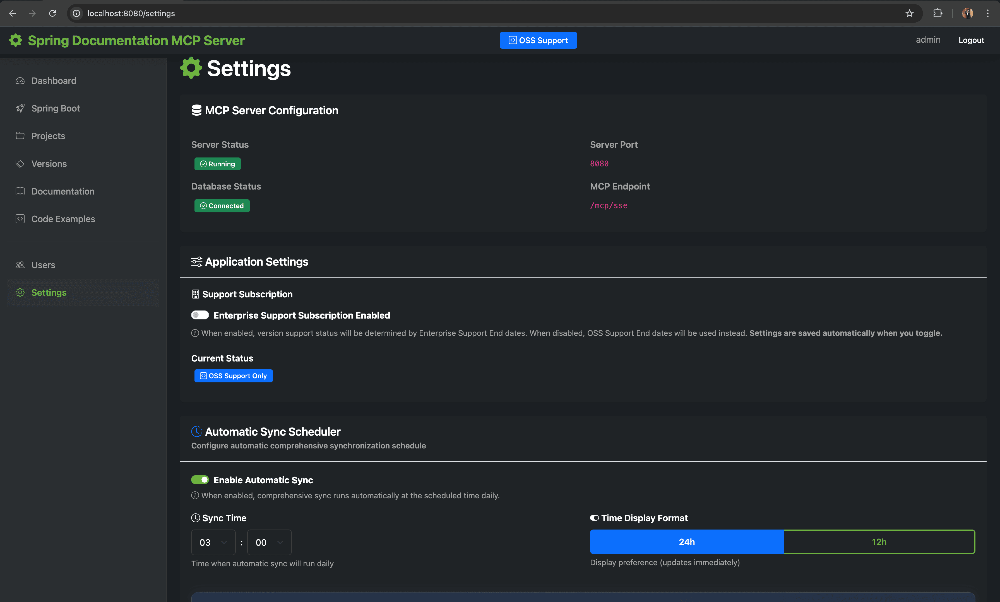
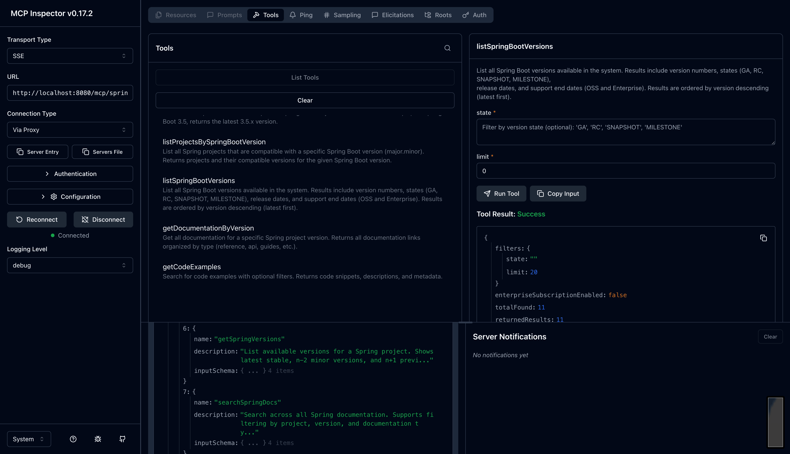

# Spring Documentation MCP Server

A comprehensive Spring Boot application that serves as a Model Context Protocol (MCP) Server, providing AI assistants with full-text searchable access to Spring ecosystem documentation via Server-Sent Events (SSE).

## What is this?

This MCP server enables AI assistants (like Claude) to search, browse, and retrieve Spring Framework documentation, code examples, and API references. It includes:

- **MCP Server**: SSE-based protocol implementation using Spring AI
- **Documentation Sync**: Automated synchronization from spring.io and GitHub spring-projects repositories
- **GitHub Source Docs**: Direct AsciiDoc documentation fetching from Spring project repositories with version-aware paths
- **Full-Text Search**: PostgreSQL-powered search across all Spring documentation (spring.io + GitHub sources)
- **Web Management UI**: Thymeleaf-based interface for managing projects, versions, and documentation
- **Code Examples**: Searchable repository of Spring code snippets
- **Migration Recipes**: OpenRewrite-based migration knowledge for Spring Boot version upgrades with breaking changes and transformations
- **Language Evolution**: Java (8+) and Kotlin (1.6+) feature tracking with deprecations, removals, and code pattern examples
- **Flavors**: Company-specific guidelines, architecture patterns, compliance rules, AI agent configurations, and project initialization templates

## Changelog

> **Full changelog**: See [CHANGELOG.md](CHANGELOG.md) for detailed version history.

### Recent Releases

| Version | Date | Highlights                                                   |
|---------|------|--------------------------------------------------------------|
| **1.3.2** | 2025-12-02 | YAML metadata headers for Flavors import/export, new example |
| **1.3.1** | 2025-12-01 | GitHub documentation scanner, enhanced code examples         |
| **1.3.0** | 2025-11-30 | Flavors feature (8 MCP tools)                                |
| **1.2.0** | 2025-11-29 | Language Evolution tracking (6 MCP tools)                    |
| **1.1.0** | 2025-11-28 | OpenRewrite migration recipes (7 MCP tools)                  |
| **1.0.2** | 2025-11-27 | Spring Boot 3.5.8, example app                               |
| **1.0.1** | 2025-11-26 | Initial release (10 MCP tools)                               |

**MCP Tools**: 10 (docs) + 7 (migration) + 6 (language) + 8 (flavors) = **31 total**

## Screenshots

<table>
  <tr>
    <td width="50%">
      
      <p align="center"><b>Login</b> - Secure authentication with Spring Security</p>
    </td>
    <td width="50%">
      
      <p align="center"><b>Dashboard</b> - Overview statistics and quick actions</p>
    </td>
  </tr>
  <tr>
    <td width="50%">
      
      <p align="center"><b>Spring Boot</b> - Spring Boot project management</p>
    </td>
    <td width="50%">
      
      <p align="center"><b>Projects</b> - All Spring projects overview</p>
    </td>
  </tr>
  <tr>
    <td width="50%">
      
      <p align="center"><b>Project Details</b> - Spring Batch project details</p>
    </td>
    <td width="50%">
      
      <p align="center"><b>Versions</b> - Version management and tracking</p>
    </td>
  </tr>
  <tr>
    <td width="50%">
      
      <p align="center"><b>Documentation</b> - Full-text search and browse</p>
    </td>
    <td width="50%">
      
      <p align="center"><b>Code Examples</b> - Searchable code snippets library with language and tag filters</p>
    </td>
  </tr>
  <tr>
    <td width="50%">
      
      <p align="center"><b>Settings</b> - Application configuration, scheduler, and sync controls</p>
    </td>
    <td width="50%">
      
      <p align="center"><b>Documentation Markdown</b> - Expanded Spring Batch documentation content</p>
    </td>
  </tr>
  <tr>
    <td width="50%">
      
      <p align="center"><b>MCP Inspector</b> - MCP Inspector connected to Spring Documentation MCP Server</p>
    </td>
    <td width="50%">
      
      <p align="center"><b>Claude Code Integration</b> - Claude Code console listing all Spring Boot versions via MCP</p>
    </td>
  </tr>
  <tr>
    <td width="50%">
      
      <p align="center"><b>Spring AI Compatibility</b> - Claude using MCP to find compatible Spring AI version for Spring Boot 3.5.7</p>
    </td>
    <td width="50%">
      
      <p align="center"><b>OpenRewrite Recipe Details</b> - Migration recipe transformations with code patterns</p>
    </td>
  </tr>
  <tr>
    <td width="50%">
      
      <p align="center"><b>JDK Deprecation Query</b> - Claude Code console querying Java deprecations since JDK 8</p>
    </td>
    <td width="50%">
      
      <p align="center"><b>Language Evolution</b> - Languages page showing Java Records code example</p>
    </td>
  </tr>
  <tr>
    <td width="50%">
      
      <p align="center"><b>Flavors</b> - Company guidelines and patterns with category filtering</p>
    </td>
    <td width="50%">
      
      <p align="center"><b>Flavor Details</b> - Hexagonal Architecture pattern with markdown content</p>
    </td>
  </tr>
</table>

## Current Status

### ✅ Fully Implemented Features

#### MCP Tools (31 tools available)

**Documentation Tools (10 tools)**
1. **searchSpringDocs** - Full-text search across all Spring documentation with filters
2. **getSpringVersions** - List available versions for any Spring project
3. **listSpringProjects** - Browse all available Spring projects
4. **getDocumentationByVersion** - Get all documentation for a specific version
5. **getCodeExamples** - Search code examples with language/project/version filters
6. **listSpringBootVersions** - List Spring Boot versions with state filtering
7. **getLatestSpringBootVersion** - Get latest patch for major.minor version
8. **filterSpringBootVersionsBySupport** - Filter by support status (OSS/Enterprise)
9. **listProjectsBySpringBootVersion** - List compatible projects for Spring Boot version
10. **findProjectsByUseCase** - Search projects by use case keywords

**OpenRewrite Migration Tools (7 tools - optional)**
11. **getSpringMigrationGuide** - Get comprehensive migration guide for upgrading Spring Boot versions
12. **getBreakingChanges** - Get list of breaking changes for a specific Spring project version
13. **searchMigrationKnowledge** - Search migration knowledge base for specific topics
14. **getAvailableMigrationPaths** - Get list of available target versions for migration
15. **getTransformationsByType** - Get transformations filtered by type (IMPORT, DEPENDENCY, PROPERTY, etc.)
16. **getDeprecationReplacement** - Find the replacement for a deprecated class or method
17. **checkVersionCompatibility** - Check if dependencies are compatible with a target Spring Boot version

**Language Evolution Tools (6 tools - optional)**
18. **getLanguageVersions** - List all versions for Java or Kotlin with feature counts and status
19. **getLanguageFeatures** - Get features for a language version with optional filters (status, category)
20. **getModernPatterns** - Get old vs new code patterns for a specific feature (e.g., pre-records vs records)
21. **getLanguageVersionDiff** - Compare features between two versions to see what changed
22. **getSpringBootLanguageRequirements** - Get minimum Java/Kotlin versions required for a Spring Boot version
23. **searchLanguageFeatures** - Search language features by keyword across all versions

**Flavors Tools (8 tools - optional)**
24. **searchFlavors** - Search company guidelines, patterns, and configurations with full-text search
25. **getFlavorByName** - Get complete flavor content by unique name
26. **getFlavorsByCategory** - List flavors in a category (ARCHITECTURE, COMPLIANCE, AGENTS, INITIALIZATION, GENERAL)
27. **getArchitecturePatterns** - Get architecture patterns for specific technologies (e.g., hexagonal, microservices)
28. **getComplianceRules** - Get compliance rules by framework (GDPR, SOC2, HIPAA, etc.)
29. **getAgentConfiguration** - Get AI agent configuration for specific use cases
30. **getProjectInitialization** - Get project initialization templates and setup guides
31. **listFlavorCategories** - List all categories with counts and descriptions

#### Web Management UI
- **Dashboard** - Overview statistics and recent updates
- **Projects** - Manage Spring projects (Spring Boot, Framework, Data, Security, Cloud, etc.)
- **Versions** - Version management with latest/default marking
- **Documentation** - Cascaded view of spring.io docs and GitHub source documentation with expandable content
- **Code Examples** - Code snippet library with topic grouping, syntax highlighting, and copy-to-clipboard
- **Migration Recipes** - OpenRewrite-inspired migration knowledge browser (optional feature)
- **Languages** - Java/Kotlin version tracking with features, deprecations, and code patterns (optional feature)
- **Flavors** - Company guidelines, architecture patterns, compliance rules, and agent configurations (optional feature)
- **Users** - User management with role-based access
- **Settings** - Application configuration, feature toggles, schedulers, and API Key Management
- **Authentication** - Spring Security with session management
- **API Key Management** - Secure token-based authentication for MCP endpoints

#### Documentation Sync Services
- Automated sync from spring.io/projects
- **GitHub Documentation Sync**: Direct AsciiDoc fetching from spring-projects repositories
- Version detection and tracking with tag resolution
- Spring Boot version synchronization
- Project relationship mapping
- Spring Generations support
- Scheduled updates (configurable cron)
- Bootstrap data loading
- OpenRewrite migration recipe sync (optional)
- Language evolution sync for Java/Kotlin (optional, configurable DAILY/WEEKLY/MONTHLY)

#### Database Features
- PostgreSQL 18 with full-text search (tsvector)
- Flyway migrations for version control
- Optimized indexes for search performance
- Support for relationships and metadata

## Prerequisites

**IMPORTANT**: This project requires **Java 25** (LTS).

### Install Java 25

#### Option 1: SDKMAN (Recommended)
```bash
# Install SDKMAN
curl -s "https://get.sdkman.io" | bash

# Install Java 25
sdk install java 25.0.1-tem

# Use Java 25
sdk use java 25.0.1-tem
```

#### Option 2: Download from Adoptium
- Download from: https://adoptium.net/temurin/releases/?version=25
- Install and set JAVA_HOME

#### Option 3: Homebrew (macOS)
```bash
brew install openjdk@25
```

### Verify Installation
```bash
java -version
# Should show: openjdk version "25"
```

## Quick Start

### 1. Start PostgreSQL Database
```bash
docker-compose up -d postgres
```

### 2. Verify Database is Running
```bash
docker-compose ps
# You should see spring-mcp-db with status "Up" and "healthy"
```

### 3. Build the Application
```bash
./gradlew clean build
```

### 4. Run the Application
```bash
java -jar build/libs/spring-mcp-server-1.3.2.jar
```

Or using Gradle:
```bash
./gradlew bootRun
```

### 5. Access the Application

- **Web UI**: http://localhost:8080
- **Login**: Username: `admin`, Password: `admin`
- **MCP SSE Endpoint**: http://localhost:8080/mcp/spring/sse
- **MCP Message Endpoint**: http://localhost:8080/mcp/spring/messages

## API Key Authentication

### Creating an API Key


*API Key Management interface with secure key generation, activation/deactivation controls, and confirmation modals*

The MCP endpoints are protected by secure API key authentication. To create an API key:

1. **Log in to the Web UI** at http://localhost:8080 (Username: `admin`, Password: `admin`)
2. **Navigate to Settings** (`/settings`)
3. **Scroll to "API Key Management"** section
4. **Click "Create New API Key"** button
5. **Enter details**:
   - **Name**: Unique identifier for this key (minimum 3 characters)
   - **Description**: Optional purpose description
6. **Click "Create API Key"**
7. **⚠️ IMPORTANT**: Copy the API key immediately - it will only be shown once!

**API Key Format**: `smcp_<secure-random-string>` (256-bit cryptographically secure)

**Security Features**:
- Keys are hashed using BCrypt (cost factor 12) - never stored in plain text
- Support for activate/deactivate (soft delete)
- Last used timestamp tracking for auditing

### Using API Keys

API keys can be provided in three ways (in order of preference):

1. **X-API-Key Header** (Recommended):
   ```bash
   curl -H "X-API-Key: smcp_your_key_here" http://localhost:8080/mcp/spring/sse
   ```

2. **Authorization Bearer Header**:
   ```bash
   curl -H "Authorization: Bearer smcp_your_key_here" http://localhost:8080/mcp/spring/sse
   ```

3. **Query Parameter** (Testing only - less secure):
   ```bash
   curl "http://localhost:8080/mcp/spring/sse?api_key=smcp_your_key_here"
   ```

## Testing the MCP Server

### Option 1: MCP Inspector (Recommended for Testing)

MCP Inspector is an excellent tool for testing and debugging MCP servers. It provides a visual interface to test all MCP capabilities.

#### Install and Run MCP Inspector

```bash
npx @modelcontextprotocol/inspector
```

This will start the MCP Inspector and output something like:

```
Starting MCP inspector...
Proxy server listening on localhost:6277
Session token: 3c672c3389d66786f32ffe2f90d6d2116634bef316a09198fb6e933a5eeefe2b

MCP Inspector is up and running at:
http://localhost:6274/?MCP_PROXY_AUTH_TOKEN=3c672c3389d66786f32ffe2f90d6d2116634bef316a09198fb6e933a5eeefe2b
```

#### Configure MCP Inspector

1. Open the MCP Inspector URL in your browser
2. Select **"SSE"** as the Transport Type
3. Enter the **URL**: `http://localhost:8080/mcp/spring/sse`
4. Add **Headers** (click "Add Header"):
   - **Header Name**: `X-API-Key`
   - **Header Value**: `smcp_your_api_key_here` (your actual API key)
5. Click **"Connect"**

Once connected, you can:
- **List Tools**: View all 10 available MCP tools
- **Test Tools**: Execute tools with parameters and see responses
- **View Logs**: See real-time communication between client and server
- **Debug Issues**: Inspect request/response payloads

#### Example: Testing searchSpringDocs Tool

In MCP Inspector:
1. Navigate to the **"Tools"** tab
2. Select **"searchSpringDocs"** tool
3. Fill in parameters:
   ```json
   {
     "query": "autoconfiguration",
     "project": "spring-boot",
     "version": "3.5.7"
   }
   ```
4. Click **"Execute"**
5. View the typed response with all documentation results

### Option 2: Claude Desktop/Claude Code

Add to your Claude Desktop or Claude Code MCP configuration (`.mcp.json`):

```json
{
  "mcpServers": {
    "spring-documentation": {
      "type": "sse",
      "url": "http://localhost:8080/mcp/spring/sse",
      "headers": {
        "X-API-Key": "YOUR_API_KEY_HERE"
      }
    }
  }
}
```

**Configuration Steps**:
1. Create or edit `.mcp.json` in your project root or Claude Code configuration directory
2. Replace `YOUR_API_KEY_HERE` with your actual API key from the Settings page
3. Restart Claude Code to load the new MCP server
4. The Spring Documentation tools will be available in your Claude Code session

**Note**: The API key format is `smcp_<random-string>`. Get your key from the Web UI Settings page.

### Available MCP Tools

Once connected, the following **31 tools** are available to AI assistants (7 OpenRewrite, 6 Language Evolution, and 8 Flavors tools are optional):

#### Documentation Tools

##### 1. searchSpringDocs
Search across all Spring documentation with optional filters.

**Parameters**:
- `query` (required): Search term
- `project` (optional): Project slug (e.g., `spring-boot`)
- `version` (optional): Version string (e.g., `3.5.7`)
- `docType` (optional): Documentation type (e.g., `reference`, `api`)

**Example**:
```json
{
  "query": "autoconfiguration",
  "project": "spring-boot",
  "version": "3.5.7"
}
```

##### 2. getSpringVersions
List all available versions for a Spring project.

**Parameters**:
- `project` (required): Project slug

**Example**:
```json
{
  "project": "spring-boot"
}
```

##### 3. listSpringProjects
List all available Spring projects.

**No parameters required**.

##### 4. getDocumentationByVersion
Get all documentation for a specific project version.

**Parameters**:
- `project` (required): Project slug
- `version` (required): Version string

**Example**:
```json
{
  "project": "spring-framework",
  "version": "6.2.1"
}
```

##### 5. getCodeExamples
Search code examples with filters.

**Parameters**:
- `query` (optional): Search in title/description
- `project` (optional): Project slug
- `version` (optional): Version string
- `language` (optional): Programming language
- `limit` (optional): Max results (default: 10, max: 50)

**Example**:
```json
{
  "query": "REST controller",
  "project": "spring-boot",
  "language": "java",
  "limit": 20
}
```

#### Spring Boot Version Tools

##### 6. listSpringBootVersions
List all Spring Boot versions with optional filtering.

**Parameters**:
- `state` (optional): Filter by state ('GA', 'RC', 'SNAPSHOT', 'MILESTONE')
- `limit` (optional): Max results (default: 20, max: 100)

**Example**:
```json
{
  "state": "GA",
  "limit": 10
}
```

##### 7. getLatestSpringBootVersion
Get the latest patch version for a specific Spring Boot major.minor version.

**Parameters**:
- `majorVersion` (required): Major version (e.g., 3)
- `minorVersion` (required): Minor version (e.g., 5)

**Example**:
```json
{
  "majorVersion": 3,
  "minorVersion": 5
}
```

##### 8. filterSpringBootVersionsBySupport
Filter Spring Boot versions by support status.

**Parameters**:
- `supportActive` (optional): true for supported, false for end-of-life
- `limit` (optional): Max results (default: 20, max: 100)

**Example**:
```json
{
  "supportActive": true,
  "limit": 20
}
```

##### 9. listProjectsBySpringBootVersion
List all Spring projects compatible with a specific Spring Boot version.

**Parameters**:
- `majorVersion` (required): Spring Boot major version
- `minorVersion` (required): Spring Boot minor version

**Example**:
```json
{
  "majorVersion": 3,
  "minorVersion": 5
}
```

##### 10. findProjectsByUseCase
Search for Spring projects by use case keywords.

**Parameters**:
- `useCase` (required): Use case keyword (e.g., 'data access', 'security', 'messaging')

**Example**:
```json
{
  "useCase": "security"
}
```

#### OpenRewrite Migration Tools (Optional)

These tools are only available when `mcp.features.openrewrite.enabled=true` (default).

##### 11. getSpringMigrationGuide
Get comprehensive migration guide for upgrading Spring Boot versions. Returns all breaking changes, import updates, dependency changes, property migrations, and code modifications needed.

**Parameters**:
- `fromVersion` (required): Source Spring Boot version (e.g., '3.5.8')
- `toVersion` (required): Target Spring Boot version (e.g., '4.0.0')

**Example**:
```json
{
  "fromVersion": "3.5.8",
  "toVersion": "4.0.0"
}
```

##### 12. getBreakingChanges
Get list of breaking changes for a specific Spring project version. Returns severity levels: CRITICAL, ERROR, WARNING, INFO.

**Parameters**:
- `project` (required): Project slug (e.g., 'spring-boot', 'spring-security')
- `version` (required): Target version to check (e.g., '4.0.0')

**Example**:
```json
{
  "project": "spring-boot",
  "version": "4.0.0"
}
```

##### 13. searchMigrationKnowledge
Search migration knowledge base for specific topics. Returns relevant transformations with code examples.

**Parameters**:
- `searchTerm` (required): Search term (e.g., 'flyway', 'actuator health', '@MockBean')
- `project` (optional): Project to search in (default: 'spring-boot')
- `limit` (optional): Maximum results to return (default: 10)

**Example**:
```json
{
  "searchTerm": "MockBean replacement",
  "project": "spring-boot",
  "limit": 5
}
```

##### 14. getAvailableMigrationPaths
Get list of available target versions for migration. Use this to discover documented upgrade paths.

**Parameters**:
- `project` (required): Project slug (e.g., 'spring-boot')

**Example**:
```json
{
  "project": "spring-boot"
}
```

##### 15. getTransformationsByType
Get transformations filtered by type for a specific migration.

**Parameters**:
- `project` (required): Project slug (e.g., 'spring-boot')
- `version` (required): Target version (e.g., '4.0.0')
- `type` (required): Transformation type (IMPORT, DEPENDENCY, PROPERTY, CODE, BUILD, TEMPLATE, ANNOTATION, CONFIG)

**Example**:
```json
{
  "project": "spring-boot",
  "version": "4.0.0",
  "type": "DEPENDENCY"
}
```

##### 16. getDeprecationReplacement
Find the replacement for a deprecated class or method. Use when you encounter deprecated APIs.

**Parameters**:
- `className` (required): Fully qualified deprecated class name
- `methodName` (optional): Deprecated method name (null for entire class deprecation)

**Example**:
```json
{
  "className": "org.springframework.boot.actuate.health.Health",
  "methodName": "status"
}
```

##### 17. checkVersionCompatibility
Check if specific dependencies are compatible with a target Spring Boot version.

**Parameters**:
- `springBootVersion` (required): Target Spring Boot version (e.g., '4.0.0')
- `dependencies` (required): List of dependencies to check (e.g., ['spring-security', 'flyway'])

**Example**:
```json
{
  "springBootVersion": "4.0.0",
  "dependencies": ["spring-security", "flyway", "thymeleaf"]
}
```

#### Language Evolution Tools (Optional)

These tools are only available when `mcp.features.language-evolution.enabled=true` (default).

##### 18. getLanguageVersions
List all versions for Java or Kotlin with feature counts and support status.

**Parameters**:
- `language` (required): Language to query ('java' or 'kotlin')

**Example**:
```json
{
  "language": "java"
}
```

##### 19. getLanguageFeatures
Get features for a language version with optional filtering by status and category.

**Parameters**:
- `language` (required): Language ('java' or 'kotlin')
- `version` (optional): Specific version (e.g., '21', '1.9')
- `status` (optional): Feature status ('NEW', 'DEPRECATED', 'REMOVED', 'PREVIEW', 'INCUBATING')
- `category` (optional): Feature category (e.g., 'Language', 'API', 'Performance')

**Example**:
```json
{
  "language": "java",
  "version": "21",
  "status": "NEW",
  "category": "Language"
}
```

##### 20. getModernPatterns
Get old vs new code patterns for a specific feature (e.g., how to migrate from pre-records to records).

**Parameters**:
- `featureId` (required): The ID of the feature to get patterns for

**Example**:
```json
{
  "featureId": 42
}
```

**Returns**: Code patterns showing the old way vs the new modern way with explanations.

##### 21. getLanguageVersionDiff
Compare features between two versions to see what was added, deprecated, or removed.

**Parameters**:
- `language` (required): Language ('java' or 'kotlin')
- `fromVersion` (required): Starting version (e.g., '17')
- `toVersion` (required): Target version (e.g., '21')

**Example**:
```json
{
  "language": "java",
  "fromVersion": "17",
  "toVersion": "21"
}
```

**Returns**: Lists of new features, deprecated features, and removed features between versions.

##### 22. getSpringBootLanguageRequirements
Get minimum Java and Kotlin versions required for a specific Spring Boot version.

**Parameters**:
- `springBootVersion` (required): Spring Boot version (e.g., '3.5.8', '4.0.0')

**Example**:
```json
{
  "springBootVersion": "3.5.8"
}
```

**Returns**: Minimum required versions for Java and Kotlin, plus recommended versions.

##### 23. searchLanguageFeatures
Search language features by keyword across all versions.

**Parameters**:
- `searchTerm` (required): Search keyword (e.g., 'record', 'sealed', 'pattern matching')
- `language` (optional): Filter by language ('java' or 'kotlin')

**Example**:
```json
{
  "searchTerm": "pattern matching",
  "language": "java"
}
```

#### Flavors Tools (Optional)

These tools are only available when `mcp.features.flavors.enabled=true` (default).

##### 24. searchFlavors
Search company guidelines, patterns, and configurations with full-text search.

**Parameters**:
- `query` (required): Search term (e.g., 'hexagonal', 'GDPR', 'microservices')
- `category` (optional): Filter by category ('ARCHITECTURE', 'COMPLIANCE', 'AGENTS', 'INITIALIZATION', 'GENERAL')
- `limit` (optional): Maximum results to return (default: 10)

**Example**:
```json
{
  "query": "hexagonal architecture",
  "category": "ARCHITECTURE",
  "limit": 5
}
```

##### 25. getFlavorByName
Get complete flavor content by unique name.

**Parameters**:
- `uniqueName` (required): The unique identifier of the flavor (e.g., 'hexagonal-architecture')

**Example**:
```json
{
  "uniqueName": "hexagonal-architecture"
}
```

**Returns**: Complete flavor with metadata, content, tags, and related flavors.

##### 26. getFlavorsByCategory
List all flavors in a specific category.

**Parameters**:
- `category` (required): Category name ('ARCHITECTURE', 'COMPLIANCE', 'AGENTS', 'INITIALIZATION', 'GENERAL')
- `activeOnly` (optional): Only return active flavors (default: true)

**Example**:
```json
{
  "category": "ARCHITECTURE",
  "activeOnly": true
}
```

##### 27. getArchitecturePatterns
Get architecture patterns for specific technologies or approaches.

**Parameters**:
- `technology` (optional): Filter by technology (e.g., 'spring', 'microservices', 'event-driven')
- `pattern` (optional): Filter by pattern name (e.g., 'hexagonal', 'clean', 'layered')

**Example**:
```json
{
  "technology": "spring",
  "pattern": "hexagonal"
}
```

##### 28. getComplianceRules
Get compliance rules by regulatory framework.

**Parameters**:
- `framework` (required): Compliance framework ('GDPR', 'SOC2', 'HIPAA', 'PCI-DSS', 'ISO27001')
- `domain` (optional): Specific domain (e.g., 'data-retention', 'access-control')

**Example**:
```json
{
  "framework": "GDPR",
  "domain": "data-retention"
}
```

##### 29. getAgentConfiguration
Get AI agent configuration for specific use cases.

**Parameters**:
- `useCase` (required): Use case type (e.g., 'code-review', 'documentation', 'testing')
- `language` (optional): Programming language context (e.g., 'java', 'kotlin')

**Example**:
```json
{
  "useCase": "code-review",
  "language": "java"
}
```

##### 30. getProjectInitialization
Get project initialization templates and setup guides.

**Parameters**:
- `projectType` (required): Type of project (e.g., 'spring-boot', 'microservice', 'library')
- `features` (optional): List of features to include (e.g., ['security', 'database', 'messaging'])

**Example**:
```json
{
  "projectType": "spring-boot",
  "features": ["security", "database"]
}
```

##### 31. listFlavorCategories
List all available categories with counts and descriptions.

**No parameters required**.

**Returns**: List of categories with flavor counts and descriptions.

## Configuration

### Environment Variables

```bash
# Database Configuration
export DB_HOST=localhost
export DB_PORT=5432
export DB_NAME=spring_mcp
export DB_USER=postgres
export DB_PASSWORD=postgres

# Security
export ADMIN_USER=admin
export ADMIN_PASSWORD=changeme

# Server
export SERVER_PORT=8080

# Documentation Bootstrap
export BOOTSTRAP_DOCS=false  # Set to true to load sample data on startup
```

### Application Configuration

Key configuration in `src/main/resources/application.yml`:

```yaml
spring:
  ai:
    mcp:
      server:
        name: "spring-documentation-server"
        type: "sync"
        version: "1.0.0"
        instructions: |
          Spring Documentation MCP Server provides comprehensive access...

        sse-endpoint: /mcp/spring/sse
        sse-message-endpoint: /mcp/spring/messages

        capabilities:
          tool: true
          completion: false
          prompt: false
          resource: false

mcp:
  documentation:
    fetch:
      enabled: true
      schedule: "0 0 2 * * ?"  # Daily at 2 AM

    bootstrap:
      enabled: ${BOOTSTRAP_DOCS:false}
      on-startup: false
      projects:
        - spring-boot
        - spring-framework
        - spring-data
        - spring-security
        - spring-cloud

    search:
      max-results: 50
      default-limit: 20
```

## Technology Stack

### Core Framework
- **Spring Boot**: 3.5.8
- **Java**: 21+ (25 recommended)
- **Build Tool**: Gradle 9.2.0

### MCP Protocol
- **Spring AI MCP Server**: 1.1.0
- **Protocol**: Server-Sent Events (SSE)
- **Auto-discovery**: `@Tool` annotations

### Data Layer
- **Database**: PostgreSQL 18
- **ORM**: Spring Data JPA / Hibernate 6.6
- **Migrations**: Flyway
- **Full-Text Search**: PostgreSQL tsvector + tsquery

### UI Layer
- **Template Engine**: Thymeleaf 3.1
- **Layout**: Thymeleaf Layout Dialect
- **CSS Framework**: Bootstrap 5
- **Security**: Spring Security 6 (Spring Security Extras for Thymeleaf)

### Documentation Fetching
- **HTML Parsing**: JSoup 1.21.2
- **JavaScript Support**: HtmlUnit 4.18.0
- **HTML to Markdown**: Flexmark 0.64.8
- **AsciiDoc Processing**: AsciidoctorJ 3.0.0 (for GitHub source documentation)
- **HTTP Client**: Spring WebFlux WebClient

### Security & Monitoring
- **Authentication**: Spring Security Basic Auth
- **Session Management**: HTTP Session
- **Health Checks**: Spring Boot Actuator
- **Logging**: Logback

## Database Schema

### Core Tables

- **spring_projects** - Spring ecosystem projects (Boot, Framework, Data, etc.)
- **project_versions** - Version tracking with state (STABLE, RC, SNAPSHOT)
- **documentation_types** - Types of documentation (Reference, API, Guide, Tutorial)
- **documentation_links** - Links to documentation resources
- **documentation_content** - Cached documentation with full-text search index
- **code_examples** - Code snippets with tags and metadata
- **users** - Application users with roles
- **settings** - Application-wide settings

### Full-Text Search

PostgreSQL tsvector is used for efficient full-text search:

```sql
-- Search query example
SELECT dl.id
FROM documentation_content dc
JOIN documentation_links dl ON dc.link_id = dl.id
WHERE dc.indexed_content @@ plainto_tsquery('english', 'spring boot autoconfiguration')
ORDER BY ts_rank_cd(dc.indexed_content, plainto_tsquery('english', 'spring boot autoconfiguration')) DESC
```

## Development

### Running Tests
```bash
./gradlew test
```

### Running with Dev Tools
```bash
./gradlew bootRun
# Dev tools will auto-reload on file changes
```

### Database Migrations

View migration status:
```bash
./gradlew flywayInfo
```

Migrations are applied automatically on startup. Manual migration:
```bash
./gradlew flywayMigrate
```

### Cleaning Build
```bash
./gradlew clean
./gradlew build --refresh-dependencies
```

## API Endpoints

### Web UI
- `GET /` - Dashboard
- `GET /projects` - Projects list
- `GET /versions` - Versions list
- `GET /documentation` - Documentation list with search
- `GET /examples` - Code examples
- `GET /users` - User management (Admin only)
- `GET /settings` - Application settings

### REST API
- `GET /api/documentation/{id}/content` - Get documentation content
- `GET /api/documentation/{id}/markdown` - Get documentation as Markdown
- `POST /api/sync/comprehensive` - Trigger comprehensive sync
- `POST /api/sync/projects` - Sync projects
- `POST /api/sync/versions` - Sync versions

### MCP Protocol
- **SSE Endpoint**: `/mcp/spring/sse` (connection endpoint)
- **Message Endpoint**: `/mcp/spring/messages` (messaging endpoint)
- **Authentication**: API Key (X-API-Key header, Bearer token, or query parameter)

### Health & Monitoring
- `GET /actuator/health` - Health check
- `GET /actuator/info` - Application info
- `GET /actuator/metrics` - Metrics

## Features in Detail

### Documentation Synchronization

The system can automatically sync documentation from multiple sources:

**Spring.io Sync**:
1. **Project Discovery**: Crawls spring.io/projects to discover projects
2. **Version Detection**: Detects available versions for each project
3. **Documentation Fetching**: Downloads and parses documentation HTML
4. **Content Conversion**: Converts HTML to searchable Markdown
5. **Indexing**: Builds PostgreSQL full-text search index

**GitHub Source Documentation Sync** (New in v1.3.1):
1. **Repository Access**: Fetches documentation directly from spring-projects GitHub repositories
2. **Version-Aware Paths**: Configurable documentation paths per project with version threshold overrides
3. **Tag Resolution**: Automatic resolution of version tags (with configurable tag prefixes)
4. **AsciiDoc Processing**: Full AsciiDoc-to-HTML conversion using AsciidoctorJ
5. **Cascaded View**: Documentation displayed in two tiers: spring.io reference + GitHub source docs

**Scheduling**:
- Runs daily updates (configurable cron)
- Settings page → "Sync Documentation" button for manual trigger
- Or use REST API: `POST /api/sync/comprehensive`

### Full-Text Search

Search features:
- Natural language queries via `plainto_tsquery`
- Relevance ranking with `ts_rank_cd`
- Filter by project, version, documentation type
- Pagination support
- Highlighted snippets (planned)

### Code Examples

The Code Examples feature provides a searchable repository of Spring code snippets that can be accessed both through the MCP server and the web UI.

**Features**:
- **Rich Code Snippets**: Store complete code examples with syntax highlighting (highlight.js with Atom One Dark theme)
- **Topic Grouping**: Examples organized by category/topic for easy browsing
- **Code View Modal**: Click-to-view modal with copy-to-clipboard functionality
- **Preserved Formatting**: Line breaks and indentation preserved for proper code display
- **Title & Description**: Each example has a descriptive title and detailed explanation
- **Language Support**: Tag examples with programming language (Java, Kotlin, Groovy, XML, YAML, etc.)
- **Category Organization**: Organize examples into logical categories (Configuration, REST API, Data Access, Security, etc.)
- **Tag System**: Multiple tags per example for enhanced discoverability
- **Version Association**: Link examples to specific Spring project versions
- **Source Tracking**: Reference original source URLs for attribution
- **Full-Text Search**: Search across titles, descriptions, and code content
- **MCP Integration**: Available via `getCodeExamples` tool for AI assistants

**Use Cases**:
- Quick reference for common Spring patterns
- Learning Spring best practices
- Sharing code snippets with team members
- Building a knowledge base of working examples
- AI-assisted code generation with real examples

### OpenRewrite Migration Recipes (Optional Feature)

The OpenRewrite Migration Recipes feature provides comprehensive migration knowledge for upgrading between Spring ecosystem versions. This is an **optional feature** that can be enabled or disabled via configuration.

**Configuration**:

```yaml
# application.yml
mcp:
  features:
    openrewrite:
      enabled: true  # Set to false to disable (default: true)
```

Or via environment variable:
```bash
export MCP_FEATURES_OPENREWRITE_ENABLED=false
```

**Features**:
- **Dynamic Recipe Generation**: Recipes are automatically generated based on Spring projects in your database
- **Version Upgrade Paths**: Covers migrations between consecutive major.minor versions
- **Transformation Types**: Includes dependencies, imports, properties, and annotation changes
- **55+ Spring Projects**: Supports all major Spring ecosystem projects
- **Dark Mode UI**: Dedicated browsing interface matching the application theme

**How It Works**:
1. **Sync Projects First**: Ensure Spring projects are synced via the Sync page
2. **Sync Recipes**: Click "Sync Recipes" on the Sync page to generate migration recipes
3. **Browse Recipes**: Navigate to the Recipes page to view all available migration paths
4. **View Details**: Click on any recipe to see transformation patterns

**Recipe Types Generated**:
- **Incremental Upgrades**: e.g., Spring Boot 3.0 → 3.1, 3.1 → 3.2
- **Latest Upgrades**: e.g., Spring Boot 2.7 → 3.5 (comprehensive upgrade)

**Transformation Categories**:
- **Dependencies**: Maven/Gradle dependency version updates
- **Imports**: Package and class import changes
- **Properties**: Configuration property migrations
- **Annotations**: Framework annotation updates

**Attribution**: Migration knowledge is inspired by [OpenRewrite](https://docs.openrewrite.org/) - an open-source automated refactoring ecosystem. Visit their documentation for detailed migration recipes and tooling.

### Language Evolution Tracking (Optional Feature)

The Language Evolution feature provides comprehensive tracking of Java (8+) and Kotlin (1.6+) language changes, helping developers understand what features are available in each version.

**Configuration**:

```yaml
# application.yml
mcp:
  features:
    language-evolution:
      enabled: true  # Set to false to disable (default: true)
```

Or via environment variable:
```bash
export LANGUAGE_EVOLUTION_ENABLED=false
```

**Features**:
- **Version Tracking**: All Java versions from 8 onwards, Kotlin from 1.6 onwards
- **Feature Status**: NEW, DEPRECATED, REMOVED, PREVIEW, INCUBATING
- **JEP/KEP Tracking**: Links to Java Enhancement Proposals and Kotlin Evolution Proposals
- **Code Patterns**: Old vs new code examples showing how to modernize code
- **Spring Boot Compatibility**: Which Java/Kotlin versions are required for each Spring Boot version
- **Version Comparison**: Compare features between two versions to see what changed
- **Flexible Scheduling**: DAILY, WEEKLY (with weekday selection), or MONTHLY sync

**How It Works**:
1. **Navigate to Languages page**: View all tracked language versions and features
2. **Filter by criteria**: Language, version, feature status, category, or search term
3. **View feature details**: Click on any feature to see description, JEP/KEP link, and code patterns
4. **Compare versions**: Use the version diff tool to see what changed between releases
5. **Check Spring Boot requirements**: Know minimum language versions for your Spring Boot version

**Use Cases**:
- **Modernization**: Find deprecated APIs and their modern replacements
- **Migration Planning**: Understand what features you gain/lose when upgrading Java versions
- **Code Review**: Verify code uses modern idioms for the target Java version
- **Learning**: Discover new language features with practical code examples
- **AI Assistance**: Let AI assistants query language evolution data to suggest modernizations

**Attribution**: Language data is compiled from official sources:
- Java: [OpenJDK JEPs](https://openjdk.org/jeps) (GPL-2.0)
- Kotlin: [Kotlin KEEP](https://github.com/Kotlin/KEEP) (Apache-2.0)

### Flavors - Company Guidelines & Patterns (Optional Feature)

The Flavors feature provides a flexible system for managing company-specific guidelines, architecture patterns, compliance rules, AI agent configurations, and project initialization templates. This is an **optional feature** that can be enabled or disabled via configuration.

**Configuration**:

```yaml
# application.yml
mcp:
  features:
    flavors:
      enabled: true  # Set to false to disable (default: true)
```

Or via environment variable:
```bash
export FLAVORS_ENABLED=false
```

**Features**:
- **5 Categories**: Architecture, Compliance, Agents, Initialization, General
- **Markdown Content**: Rich content with full-text search using PostgreSQL tsvector
- **Import/Export with YAML Metadata**: Share flavors between teams via markdown files with optional YAML front matter headers containing metadata (unique-name, display-name, category, pattern-name, description, tags)
- **Create from Scratch**: Build flavors directly in the UI editor
- **Category Filtering**: Quick access to flavors by category
- **Dashboard Integration**: Statistics showing flavor counts by category
- **8 MCP Tools**: AI assistants can query flavor data for context-aware assistance

**YAML Front Matter Format** (v1.3.2+):
```markdown
---
unique-name: my-flavor-identifier
display-name: My Flavor Display Name
category: ARCHITECTURE
pattern-name: Optional Pattern Name
description: Brief description of the flavor content
tags: tag1, tag2, tag3
---

# Actual Markdown Content Here
...
```

When importing, all metadata fields are automatically extracted from the YAML header. When exporting, you can choose to include or exclude the metadata header via a toggle in the export modal.

**Categories Explained**:
- **Architecture**: Design patterns and architectural guidelines (hexagonal, microservices, event-driven)
- **Compliance**: Regulatory requirements and security standards (GDPR, SOC2, HIPAA, PCI-DSS)
- **Agents**: AI agent configurations and prompts for specific tasks
- **Initialization**: Project setup templates and bootstrapping guides
- **General**: Miscellaneous guidelines, coding standards, and best practices

**How It Works**:
1. **Navigate to Flavors page**: View all company guidelines and patterns
2. **Create or Import**: Add new flavors from scratch or import markdown files
3. **Organize by Category**: Assign flavors to appropriate categories
4. **Search and Filter**: Find relevant guidelines using full-text search
5. **Export for Sharing**: Export flavors as markdown for team distribution
6. **AI Integration**: MCP tools allow AI assistants to access flavor data

**Use Cases**:
- **Onboarding**: New team members access company coding standards and patterns
- **Architecture Reviews**: Reference approved architecture patterns during design
- **Compliance Checks**: AI assistants can verify code against compliance rules
- **Project Setup**: Consistent project initialization across teams
- **AI-Assisted Development**: Claude Code uses flavors for company-specific context

### Scheduler Configuration

The built-in scheduler allows you to automate documentation synchronization on a configurable schedule.

**Configuration (Settings Page)**:
- **Enable/Disable Sync**: Toggle automatic synchronization on or off
- **Sync Time**: Set the daily sync time in 24-hour or 12-hour format (e.g., "03:00" or "3:00 AM")
- **Time Format**: Choose between 24-hour (military) or 12-hour (AM/PM) time display
- **Next Sync Run**: View when the next scheduled synchronization will occur
- **Last Sync Run**: Track when the last successful sync completed
- **Manual Trigger**: Run synchronization immediately via "Sync Now" button

**How It Works**:
1. The scheduler runs a comprehensive documentation sync at the configured time
2. Synchronization includes:
   - Spring project metadata updates
   - New version detection
   - Documentation link discovery
   - Spring Boot version compatibility mapping
   - Spring Generations tracking
3. All sync operations are logged for troubleshooting
4. Failed syncs are reported in the application logs

**Best Practices**:
- Schedule syncs during low-traffic periods (e.g., 2-4 AM)
- Allow sufficient time between syncs (daily is recommended)
- Monitor logs after scheduling changes to ensure proper operation
- Use manual sync for immediate updates when needed

## Troubleshooting

### Java Version Issues

Error: "Unsupported class file major version"

**Solution**:
```bash
java -version  # Verify Java 25
echo $JAVA_HOME  # Ensure JAVA_HOME points to Java 25
```

### Database Connection Issues

**Check PostgreSQL**:
```bash
docker-compose ps
docker-compose logs postgres
```

**Verify connection**:
```bash
psql -h localhost -U postgres -d spring_mcp
# Password: postgres
```

### Build Issues

**Clean and rebuild**:
```bash
./gradlew clean build --refresh-dependencies
```

### Port Already in Use

**Kill process on port 8080**:
```bash
lsof -ti :8080 | xargs kill -9
```

### MCP Connection Issues

1. **Verify application is running**:
   ```bash
   curl http://localhost:8080/actuator/health
   ```

2. **Check MCP endpoint with API key**:
   ```bash
   curl -H "X-API-Key: your_api_key" http://localhost:8080/mcp/spring/sse
   ```

3. **Test with MCP Inspector**:
   ```bash
   npx @modelcontextprotocol/inspector
   ```
   Then configure with URL: `http://localhost:8080/mcp/spring/sse` and your API key header.

4. **Review application logs**:
   ```bash
   tail -f logs/spring-mcp-server.log
   ```

5. **Check registered tools**:
   ```bash
   grep "Registered tools" logs/spring-mcp-server.log
   # Should show: Registered tools: 10
   ```

## Roadmap

### Completed ✅
- [x] Spring Boot 3.5.8 project setup using Spring AI 1.1.0
- [x] PostgreSQL database with Docker Compose
- [x] Flyway migrations
- [x] Entity models and repositories
- [x] Spring Security with API Key authentication
- [x] Thymeleaf UI with Bootstrap 5
- [x] MCP Server with Spring AI (SSE-based)
- [x] 31 MCP tools implemented with typed DTOs (10 documentation + 7 migration + 6 language + 8 flavors)
- [x] Full-text search with PostgreSQL
- [x] Documentation sync services
- [x] Version detection and tracking
- [x] Web management UI (all pages)
- [x] User management
- [x] Settings management
- [x] API Key management with BCrypt encryption
- [x] Code examples repository
- [x] Spring Boot version compatibility tracking
- [x] Scheduler configuration for automated syncs
- [x] OpenRewrite migration recipes (optional feature)
- [x] Language Evolution tracking for Java/Kotlin (optional feature)
- [x] Flavors - Company guidelines, architecture patterns, and compliance rules (optional feature)
- [x] Migration guides between versions
- [x] Comprehensive documentation coverage for all Spring projects
- [x] Enhanced search with highlighting and snippets
- [x] More code examples across Spring ecosystem
- [x] GitHub integration for code samples
- [x] Migration of Manual Tool registration to @McpTool

### In Progress 🚧

- [ ] Performance optimization for large result sets

### Planned 📋
- [ ] Semantic search using embeddings
- [ ] Version comparison and diff
- [ ] Export features (PDF, Markdown)
- [ ] Analytics and usage tracking
- [ ] Multi-language documentation support
- [ ] Offline mode
- [ ] Air-Gapped Replication Mode for cascaded setups
- [ ] Additional MCP resources (prompts, completions)
- [ ] Spring Initializr integration

## Contributing

This is a demonstration/reference MCP server implementation. Contributions are welcome!

Areas for contribution:
- Additional Spring project coverage
- Enhanced search algorithms
- UI/UX improvements
- Performance optimizations
- Documentation
- Test coverage

## License

This project is licensed under the MIT License - see the [LICENSE](LICENSE) file for details.

## Resources

- **Spring AI MCP Server Docs**: https://docs.spring.io/spring-ai/reference/api/mcp/mcp-overview.html
- **MCP Protocol Specification**: https://spec.modelcontextprotocol.io/
- **Spring Documentation**: https://spring.io/projects

