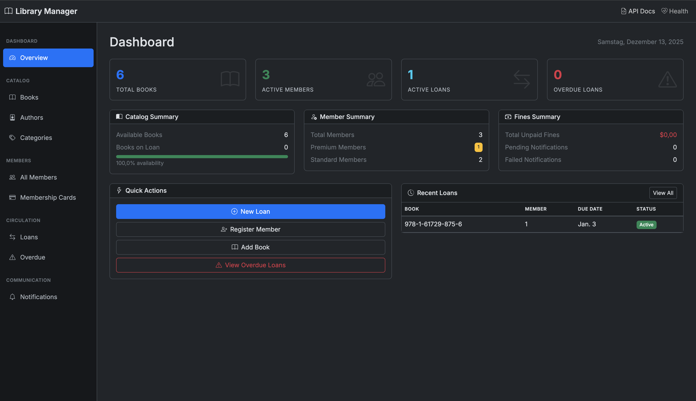

# Library Management System - Spring Boot 4 / Spring Modulith 2.0

A demonstration application showcasing **Spring Boot 4.0.0**, **Spring Modulith 2.0**, **Spring Framework 7 API Versioning**, and **springdoc-openapi 3.0** with a beautiful dark-themed Thymeleaf UI.

> **AI-Generated Demo**: This application was created using Claude Code with the Spring Documentation MCP Server. The MCP Server provided version information, architecture patterns (flavors), and best practices for Spring Boot 4, Spring Modulith 2.0, and OpenAPI documentation.
>
> See [Prompts Used](#prompts-used) and [MCP Tools Used](#mcp-tools-used) sections below.

<p align="center">
  
  <br>
  <em>Library Management System Dashboard - Dark Theme UI</em>
</p>

## Features

- **Modular Monolith Architecture** - Spring Modulith 2.0 with Named Interfaces
- **API Versioning** - Spring Framework 7's native `@GetMapping(version = "2.0+")` support
- **OpenAPI 3.1 Documentation** - springdoc-openapi 3.0 with Swagger UI
- **Dark Theme Web UI** - Thymeleaf 3.4, Bootstrap 5, HTMX for dynamic interactions
- **Custom Actuator Endpoints** - Library metrics and module health
- **Event-Driven Communication** - Loose coupling between modules via domain events
- **Event Publication Registry** - Spring Modulith 2.0's at-least-once delivery guarantee
- **Externalized Events** - Ready for Kafka/RabbitMQ integration via `@Externalized`
- **Idempotent Event Handling** - Resilient notification processing with retry support
- **Full CRUD Operations** - Books, Members, Loans, Notifications via REST and Web UI

## Technology Stack

| Component | Technology | Version |
|-----------|------------|---------|
| Framework | Spring Boot | 4.0.0 |
| Core | Spring Framework | 7.0.1 |
| Modulith | Spring Modulith | 2.0.0 |
| Java | OpenJDK | 25 (LTS) |
| Database | PostgreSQL | 18 |
| Build Tool | Gradle | 9.2.0 |
| API Docs | springdoc-openapi | 3.0.0 |
| UI | Thymeleaf | 3.4 |
| CSS Framework | Bootstrap | 5.3.3 |

**Key Point**: Uses Spring Framework 7's native API versioning - no external libraries needed!

## Quick Start

### Prerequisites

- Java 25 (LTS)
- Docker & Docker Compose
- Gradle 8.x (or use the wrapper)

### 1. Start PostgreSQL

```bash
cd examples/basic/lms-modulith-openapi
docker-compose up -d
```

**Note**: PostgreSQL runs on port **5433** (not 5432) to avoid conflicts.

### 2. Run the Application

```bash
./gradlew bootRun
```

Or build and run:

```bash
./gradlew build
java -jar build/libs/library-management-system-1.0.0.jar
```

### 3. Access the Application

| URL | Description |
|-----|-------------|
| http://localhost:8088 | Web UI Dashboard |
| http://localhost:8088/books | Book Catalog |
| http://localhost:8088/members | Member Management |
| http://localhost:8088/loans | Loan Management |
| http://localhost:8088/swagger-ui.html | API Documentation |
| http://localhost:8088/actuator/health | Health Check |

## Module Architecture

```
com.example.library
├── catalog/                 # Book, Author, Category management
│   ├── api/                 # Public API (@NamedInterface)
│   │   ├── BookController   # REST endpoints
│   │   └── BookService      # Business logic
│   ├── internal/            # Private entities & repositories
│   └── events/              # Domain events (@NamedInterface)
│
├── members/                 # Member registration & profiles
│   ├── api/                 # MemberController, MemberService
│   ├── internal/            # Member, MembershipCard entities
│   └── events/              # MemberRegisteredEvent, etc.
│
├── loans/                   # Book loans and returns
│   ├── api/                 # LoanController, LoanService
│   ├── internal/            # Loan, LoanPolicy entities
│   └── events/              # BookLoanedEvent, BookReturnedEvent
│
├── notifications/           # Alerts and reminders
│   ├── api/                 # NotificationController, NotificationService
│   └── internal/            # Event listeners
│
├── shared/                  # Open module - shared utilities
├── config/                  # Open module - configuration
└── web/                     # Open module - Thymeleaf controllers
```

## Event-Driven Architecture

This application showcases Spring Modulith 2.0's **Event Publication Registry** for reliable, transactional event handling.

### Event Flow

```
┌─────────────────┐     ApplicationEventPublisher     ┌──────────────────────┐
│   LoanService   │ ─────────────────────────────────▶│ Event Publication    │
│   publish()     │                                   │ Registry (DB)        │
└─────────────────┘                                   └──────────────────────┘
                                                               │
                                                               ▼
                                                      ┌──────────────────────┐
                                                      │ NotificationEvent    │
                                                      │ Listener (async)     │
                                                      └──────────────────────┘
                                                               │
                                                               ▼
                                                      ┌──────────────────────┐
                                                      │ NotificationService  │
                                                      │ (with idempotency)   │
                                                      └──────────────────────┘
```

### Domain Events

All domain events support external messaging via `@Externalized`:

| Event | Topic | Description |
|-------|-------|-------------|
| `BookLoanedEvent` | `library.loans.book-loaned` | Published when a book is borrowed |
| `BookReturnedEvent` | `library.loans.book-returned` | Published when a book is returned |
| `LoanOverdueEvent` | `library.loans.loan-overdue` | Published when a loan becomes overdue |
| `MemberRegisteredEvent` | `library.members.member-registered` | Published when a new member joins |
| `MemberStatusChangedEvent` | `library.members.status-changed` | Published when member status changes |

### Event Publication Registry

The application uses Spring Modulith's JPA-based event publication registry for **at-least-once delivery**:

```yaml
# application.yml
modulith:
  events:
    jdbc:
      schema-initialization:
        enabled: false  # Using Flyway migration
    republish-outstanding-events-on-restart: true
```

**Key Benefits:**
- Events persisted before processing (survives crashes)
- Automatic retry on application restart
- Audit trail of all event publications
- Integration with actuator for monitoring

### Idempotent Event Handling

Event listeners check for duplicate processing before creating notifications:

```java
@ApplicationModuleListener
public void onBookLoaned(BookLoanedEvent event) {
    // Idempotency check: Skip if already processed
    if (notificationService.existsLoanConfirmation(event.memberId(), event.loanId())) {
        log.debug("Loan confirmation already exists for loan {}, skipping", event.loanId());
        return;
    }

    notificationService.sendLoanConfirmation(
        event.memberId(),
        event.bookIsbn(),
        event.dueDate().toString()
    );
}
```

### External Messaging (Optional)

To enable Kafka/RabbitMQ event externalization, add the appropriate starter:

```groovy
// For Kafka
implementation 'org.springframework.modulith:spring-modulith-events-kafka'

// For RabbitMQ
implementation 'org.springframework.modulith:spring-modulith-events-amqp'
```

Events marked with `@Externalized` will automatically be published to the configured broker.

## API Versioning

Spring Framework 7's native API versioning support:

```java
// Version 1.0 - Basic response
@GetMapping(version = "1.0")
public List<BookResponseV1> getAllBooksV1() { ... }

// Version 2.0+ - Extended response with loan info
@GetMapping(version = "2.0+")
public List<BookResponseV2> getAllBooksV2() { ... }
```

**Usage:**

```bash
# Default (v1.0)
curl http://localhost:8088/api/books

# Explicit version via header
curl -H "API-Version: 2.0" http://localhost:8088/api/books
```

## API Endpoints

### Catalog Module

| Endpoint | Method | Description |
|----------|--------|-------------|
| `/api/books` | GET | List all books |
| `/api/books/{isbn}` | GET | Get book by ISBN |
| `/api/books` | POST | Add new book |
| `/api/books/{isbn}` | PUT | Update book |
| `/api/books/{isbn}` | DELETE | Delete book |
| `/api/authors` | GET | List all authors |
| `/api/categories` | GET | List all categories |

### Members Module

| Endpoint | Method | Description |
|----------|--------|-------------|
| `/api/members` | GET | List all members |
| `/api/members/{id}` | GET | Get member by ID |
| `/api/members` | POST | Register new member |
| `/api/members/{id}` | PUT | Update member |
| `/api/members/{id}/history` | GET | Get member's loan history |

### Loans Module

| Endpoint | Method | Description |
|----------|--------|-------------|
| `/api/loans` | GET | List all loans |
| `/api/loans` | POST | Create new loan |
| `/api/loans/{id}/return` | POST | Return a book |
| `/api/loans/{id}/renew` | POST | Renew a loan |
| `/api/loans/overdue` | GET | List overdue loans |
| `/api/loans/member/{memberId}` | GET | Member's active loans |

### Notifications Module

| Endpoint | Method | Description |
|----------|--------|-------------|
| `/api/notifications/member/{memberId}` | GET | Member's notifications |
| `/api/notifications/{id}/read` | PUT | Mark notification as read |

### Event Publications Admin API

| Endpoint | Method | Description |
|----------|--------|-------------|
| `/api/admin/events/statistics` | GET | Event publication statistics (total, completed, incomplete) |
| `/api/admin/events/incomplete` | GET | List pending event publications |
| `/api/admin/events/completed` | GET | List recent completed publications |
| `/api/admin/events/by-type/{eventType}` | GET | Filter publications by event type |
| `/api/admin/events/status` | GET | Event publication system status |
| `/api/admin/events/topics` | GET | List externalized event topics |
| `/api/admin/events/completed/older-than/{days}` | DELETE | Delete old completed publications |

### Web UI Endpoints

| Endpoint | Description |
|----------|-------------|
| `/` | Dashboard with statistics |
| `/books` | Book catalog with search and category filter |
| `/books/{isbn}` | Book detail with loan history |
| `/books/{isbn}/edit` | Edit book details |
| `/members` | Member listing with filters |
| `/members/{id}` | Member detail with loans and notifications |
| `/members/{id}/edit` | Edit member details |
| `/members/cards` | Membership cards overview |
| `/loans` | Loan listing |
| `/loans/{id}` | Loan detail view |
| `/loans/member/{memberId}` | Loans for specific member |
| `/loans/new` | Create new loan form |
| `/authors` | Author listing |
| `/categories` | Category listing |
| `/notifications` | Notification listing |

## API Response Examples

### Get Book (HTTP 200)

```json
{
  "isbn": "978-0-13-468599-1",
  "title": "Clean Code",
  "author": {
    "id": 1,
    "name": "Robert C. Martin"
  },
  "category": {
    "id": 4,
    "name": "Technology"
  },
  "totalCopies": 5,
  "availableCopies": 3,
  "available": true
}
```

### Create Loan (HTTP 201)

```json
{
  "id": 1,
  "book": { "isbn": "978-0-13-468599-1", "title": "Clean Code" },
  "member": { "id": 1, "fullName": "John Smith" },
  "loanDate": "2025-12-13",
  "dueDate": "2025-12-27",
  "status": "ACTIVE"
}
```

### Book Not Found (HTTP 404)

```json
{
  "timestamp": "2025-12-13T15:20:00Z",
  "status": 404,
  "error": "Not Found",
  "message": "Book not found with ISBN: 978-0-00-000000-0"
}
```

## Custom Actuator Endpoints

| Endpoint | Description |
|----------|-------------|
| `/actuator/health` | Health status with library metrics |
| `/actuator/info` | Application info with statistics |
| `/actuator/library` | Custom endpoint with detailed metrics |
| `/actuator/library/{module}` | Module-specific metrics |
| `/actuator/modulith` | Spring Modulith module structure |
| `/actuator/eventpublications` | Event publication registry status |

### Health Response Example

```json
{
  "status": "UP",
  "components": {
    "db": { "status": "UP", "database": "PostgreSQL" },
    "library": {
      "status": "UP",
      "details": {
        "catalog.totalBooks": 6,
        "catalog.availableBooks": 6,
        "members.total": 3,
        "members.active": 3,
        "loans.active": 1,
        "loans.overdue": 0
      }
    }
  }
}
```

## Project Structure

```
lms-modulith-openapi/
├── build.gradle
├── settings.gradle
├── docker-compose.yml
├── README.md
├── assets/                           # Screenshots
│
├── src/main/java/com/example/library/
│   ├── LibraryApplication.java
│   ├── package-info.java
│   │
│   ├── catalog/                      # Catalog Module
│   │   ├── api/
│   │   │   ├── BookController.java
│   │   │   └── BookService.java
│   │   ├── internal/
│   │   │   ├── Book.java
│   │   │   ├── Author.java
│   │   │   ├── Category.java
│   │   │   └── *Repository.java
│   │   └── events/
│   │       └── BookAddedEvent.java
│   │
│   ├── members/                      # Members Module
│   │   ├── api/
│   │   │   ├── MemberController.java
│   │   │   └── MemberService.java
│   │   ├── internal/
│   │   │   ├── Member.java
│   │   │   ├── MembershipCard.java
│   │   │   └── *Repository.java
│   │   └── events/
│   │       └── MemberRegisteredEvent.java
│   │
│   ├── loans/                        # Loans Module
│   │   ├── api/
│   │   │   ├── LoanController.java
│   │   │   └── LoanService.java
│   │   ├── internal/
│   │   │   ├── Loan.java
│   │   │   ├── LoanPolicy.java
│   │   │   └── *Repository.java
│   │   └── events/
│   │       └── BookLoanedEvent.java
│   │
│   ├── notifications/                # Notifications Module
│   │   ├── api/
│   │   │   ├── NotificationController.java
│   │   │   └── NotificationService.java
│   │   └── internal/
│   │       ├── Notification.java
│   │       └── NotificationEventListener.java
│   │
│   ├── shared/                       # Shared Module
│   ├── config/                       # Configuration
│   │   ├── OpenApiConfig.java
│   │   ├── LibraryHealthIndicator.java
│   │   ├── LibraryInfoContributor.java
│   │   └── EventPublicationController.java
│   │
│   └── web/                          # Web UI
│       └── WebController.java
│
├── src/main/resources/
│   ├── application.yml
│   ├── db/migration/
│   │   ├── V1__init_schema.sql
│   │   └── V2__add_event_publication_table.sql
│   ├── static/css/
│   │   └── dark-theme.css
│   └── templates/
│       ├── layout/main.html
│       ├── dashboard.html
│       ├── books/list.html, detail.html, edit.html
│       ├── members/list.html, detail.html, edit.html, cards.html
│       ├── loans/list.html, detail.html, member.html, new.html
│       ├── notifications/list.html
│       ├── authors/list.html
│       └── categories/list.html
│
└── src/test/java/com/example/library/
    ├── LibraryApplicationTests.java
    └── ModulithArchitectureTests.java
```

## Testing the API

### Using cURL

```bash
# List all books
curl http://localhost:8088/api/books

# Get book by ISBN
curl http://localhost:8088/api/books/978-1-61729-875-6

# Create a new member
curl -X POST http://localhost:8088/api/members \
  -H "Content-Type: application/json" \
  -d '{"firstName":"Jane","lastName":"Doe","email":"jane@example.com"}'

# Create a loan
curl -X POST http://localhost:8088/api/loans \
  -H "Content-Type: application/json" \
  -d '{"bookIsbn":"978-1-61729-875-6","memberId":1}'

# Return a book
curl -X POST http://localhost:8088/api/loans/1/return

# Check health
curl http://localhost:8088/actuator/health

# Get API documentation
curl http://localhost:8088/v3/api-docs

# View event publication statistics
curl http://localhost:8088/api/admin/events/statistics

# List incomplete (pending) event publications
curl http://localhost:8088/api/admin/events/incomplete

# View externalized event topics
curl http://localhost:8088/api/admin/events/topics

# Check event publication system status
curl http://localhost:8088/api/admin/events/status
```

## Running Tests

```bash
# Run all tests
./gradlew test

# Run only architecture tests
./gradlew test --tests ModulithArchitectureTests

# Generate module documentation
./gradlew test --tests ModulithArchitectureTests.generateDocumentation
```

## Environment Variables

| Variable | Default | Description |
|----------|---------|-------------|
| `DB_HOST` | localhost | Database host |
| `DB_PORT` | 5433 | Database port |
| `DB_NAME` | librarydb | Database name |
| `DB_USER` | library | Database user |
| `DB_PASS` | library | Database password |
| `SERVER_PORT` | 8088 | Application port |

## Sample Data

The application comes with sample data loaded via Flyway migrations:

- **Categories**: Fiction, Science, History, Technology, Philosophy, Business
- **Authors**: Classic and modern authors with biographies
- **Books**: Sample books in each category (6 total)
- **Members**: 3 sample members (ACTIVE status)
- **Loan Policies**: STANDARD (5 books, 14 days) and PREMIUM (10 books, 21 days)

---

## Prompts Used

This demo application was created through an iterative process with Claude Code:

### Prompt 1: Initial Request

```
Create a Library Management System demo in examples/basic/lms-modulith-openapi
using Spring Boot 4.0.0, Spring Modulith 2.0, and springdoc-openapi 3.0.
Use PostgreSQL on port 5433. Include a dark theme Thymeleaf UI.
Use Spring MCP Server to get version info and architecture flavors.
```

### Prompt 2: Add Web UI Pages

```
Add Thymeleaf pages for dashboard, books, members, loans with dark theme.
Create dynamic interactions. Follow the patterns from rate-limiter-demo.
```

### Prompt 3: Add Data Pages

```
For the authors, categories and membership cards endpoints the page only
shows an empty page with the hint to use the api docs. Add read only lists
to show this info extracted from their main objects.
```

### Prompt 4: Spring Modulith 2.0 Event System

```
Add Spring Modulith 2.0 Event Publication Registry support with:
- Persistent event storage for at-least-once delivery
- @Externalized annotations for Kafka/RabbitMQ integration
- Idempotent event handling for retry safety
- Event monitoring API endpoints
```

**Changes implemented:**
- Added `spring-modulith-starter-jpa` for Event Publication Registry (includes Jackson serializer)
- Created `V2__add_event_publication_table.sql` Flyway migration with Spring Modulith 2.0 schema
- Added `@Externalized` annotations to all domain events for Kafka/RabbitMQ
- Implemented idempotency checks in event listeners (retry-safe)
- Created `EventPublicationController` for event monitoring API
- Updated actuator endpoints for event publications

---

## MCP Tools Used

This project was created using the Spring MCP Server with the following tools:

| Tool | Purpose |
|------|---------|
| `listSpringBootVersions` | Get latest Spring Boot version (4.0.0) |
| `getSpringVersions` | Get Spring Modulith versions (2.0.0) |
| `getSpringBootLanguageRequirements` | Verify Java 25 compatibility |
| `initializrGetDependencyCategories` | Get available dependencies |
| `initializrGetDependency` | Get Gradle snippets |
| `searchFlavors` | Find modulith, openapi, testing patterns |
| `getFlavorByName` | Get detailed implementation guidelines |
| `searchSpringDocs` | Search Spring Modulith 2.0 event documentation |
| `getBreakingChanges` | Get Spring Modulith 2.0 migration info |

### Flavors Used

| Flavor | Purpose |
|--------|---------|
| `spring-modulith` | Module structure, Named Interfaces, Event Publication Registry |
| `spring-openapi-doc-sb4` | springdoc-openapi 3.0 configuration |
| `rest-test-client` | Testing patterns with RestTestClient |
| `event-driven-modulith` | Event externalization, idempotency patterns |

---

## Related Resources

- **Spring Boot 4.0 Documentation**: https://docs.spring.io/spring-boot/index.html
- **Spring Modulith 2.0 Reference**: https://docs.spring.io/spring-modulith/reference/
- **springdoc-openapi 3.0**: https://springdoc.org/
- **Rate Limiter Demo**: `examples/basic/rate-limiter-demo/`
- **API Versioning Demo**: `examples/basic/api-versioning-spring-boot-40/`

