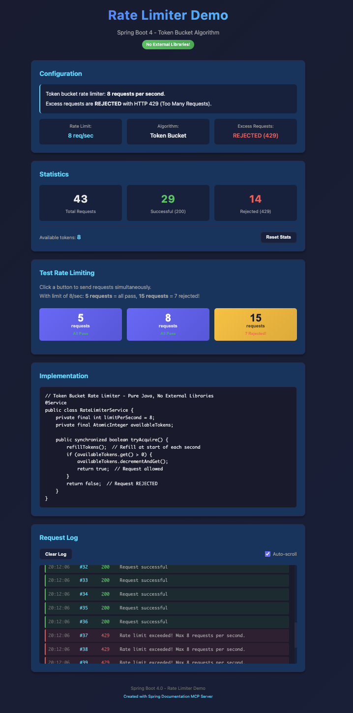

# Rate Limiter Demo - Spring Boot 4 / Token Bucket Algorithm

A demonstration application showcasing the **difference between rate limiting and concurrency limiting** in Spring Boot 4. Learn why `@ConcurrencyLimit` queues requests while proper rate limiting REJECTS them with HTTP 429.

> **AI-Generated Demo**: This application was created using Claude Code with the Spring Documentation MCP Server. The initial prompt created the app, but required **two follow-up corrections** based on user feedback. See [Prompts Used](#prompts-used) and [MCP Journey](#mcp-journey-discovery-process) sections below.
>
> **Note**: During the first run, the Spring MCP Server was down, which led to using Resilience4j initially instead of discovering Spring Boot 4's native resilience features.

<p align="center">
  
  <br>
  <em>Rate Limiting by 8 Calls/s</em>
</p>

## Features

- **Pure Java Rate Limiter** - Token Bucket algorithm with no external dependencies
- **Proper Rate Limiting** - Excess requests are REJECTED with HTTP 429 (not queued)
- **Interactive Test UI** - Dark theme UI with buttons for 5, 8, and 15 concurrent requests
- **Real-time Statistics** - Track total, successful, and rejected request counts
- **Live Request Log** - Color-coded log showing HTTP status codes (200 vs 429)
- **Code Preview** - See the actual implementation right in the UI

## Technology Stack

| Component | Technology | Version |
|-----------|------------|---------|
| Framework | Spring Boot | 4.0.0   |
| Java | OpenJDK | 25      |
| Core | Spring Framework | 7.0.x   |
| UI | Thymeleaf | 3.x     |
| Build Tool | Gradle | 8.x     |

**Key Point**: No external rate limiting libraries! Pure Java implementation using the Token Bucket algorithm.

## Quick Start

### Run the Application

```bash
# From the rate-limiter-demo directory
./gradlew bootRun
```

Or build and run:

```bash
./gradlew build
java -jar build/libs/rate-limiter-demo-1.0.0.jar
```

### Access the Application

- **Demo UI**: http://localhost:8089
- **Health Check**: http://localhost:8089/actuator/health
- **API Endpoint**: `POST http://localhost:8089/api/request`

## Token Bucket Rate Limiter

### Implementation

```java
@Service
public class RateLimiterService {
    private final int limitPerSecond = 8;
    private final AtomicInteger availableTokens;
    private final AtomicLong lastRefillTime;

    public synchronized boolean tryAcquire() {
        refillTokens();  // Refill at start of each second
        if (availableTokens.get() > 0) {
            availableTokens.decrementAndGet();
            return true;  // Request ALLOWED
        }
        return false;  // Request REJECTED
    }

    private void refillTokens() {
        long now = System.currentTimeMillis();
        if (now - lastRefillTime.get() >= 1000) {
            availableTokens.set(limitPerSecond);
            lastRefillTime.set(now);
        }
    }
}
```

### Controller Usage

```java
@PostMapping("/api/request")
public ResponseEntity<ApiResponse> makeRequest() {
    boolean allowed = rateLimiterService.tryAcquire();

    if (allowed) {
        return ResponseEntity.ok(new ApiResponse(...));  // HTTP 200
    } else {
        return ResponseEntity.status(HttpStatus.TOO_MANY_REQUESTS)
            .body(new ApiResponse(...));  // HTTP 429
    }
}
```

## Interactive Testing UI

The dark-themed UI provides three test buttons to demonstrate rate limiting:

| Button | Concurrent Requests | Expected Result |
|--------|---------------------|-----------------|
| **5 requests** | 5 simultaneous | All pass (200) |
| **8 requests** | 8 simultaneous | All pass (200) - at limit |
| **15 requests** | 15 simultaneous | 8 pass (200), **7 rejected (429)** |

### How Token Bucket Works

1. Bucket holds 8 tokens (limit per second)
2. Each request consumes 1 token
3. When tokens = 0, requests are **REJECTED** (HTTP 429)
4. Tokens refill to 8 at the start of each second
5. No queuing - excess requests fail immediately

## Rate Limiting vs Concurrency Limiting

| Feature | Rate Limiting (This Demo) | Concurrency Limiting |
|---------|---------------------------|----------------------|
| Excess requests | **REJECTED** (HTTP 429) | Queued (wait) |
| Response time | Immediate failure | Delayed response |
| Use case | Protect from overload | Control parallelism |
| Algorithm | Token Bucket | Semaphore |

## API Endpoints

| Endpoint | Method | Description |
|----------|--------|-------------|
| `/` | GET | Interactive demo UI |
| `/api/request` | POST | Rate-limited endpoint |
| `/api/stats` | GET | Current statistics |
| `/api/reset` | POST | Reset statistics |
| `/actuator/health` | GET | Health check |

## API Response Examples

### Successful Request (HTTP 200)
```json
{
  "requestId": 1,
  "success": true,
  "message": "Request successful",
  "timestamp": "2025-12-06T20:10:45.123Z"
}
```

### Rejected Request (HTTP 429)
```json
{
  "requestId": 9,
  "success": false,
  "message": "Rate limit exceeded! Max 8 requests per second.",
  "timestamp": "2025-12-06T20:10:45.124Z"
}
```

## Project Structure

```
rate-limiter-demo/
├── src/main/java/com/example/ratelimiter/
│   ├── RateLimiterDemoApplication.java     # Main application
│   ├── service/
│   │   └── RateLimiterService.java         # Token Bucket implementation
│   ├── controller/
│   │   └── RateLimiterController.java      # API endpoints
│   └── model/
│       └── ApiResponse.java                # Response record
├── src/main/resources/
│   ├── application.yml                     # Server configuration
│   ├── static/css/
│   │   └── style.css                       # Dark theme styles
│   └── templates/
│       └── index.html                      # Demo UI
├── build.gradle
└── README.md
```

---

## Prompts Used

This demo application was created through an iterative process with Claude Code:

### Prompt 1: Initial Request

```
now in the folder playground/, create a simple rate limiter app based on spring boot 4.0
using the embedded resilience patterns of spring boot 4 to show case using rate limiters.
use spring mcp server and the initializr to create the project and make a demo with it's
own ui page to test rate limiter like a button 1 request per second, 5 requests per second
and 10 request per second while the rate limiter will allow 8 requests per second.
Create a dark mode ui like the example: examples/basic/api-versioning-spring-boot-40.
also create a README.md for this project in the root of the project folder playground/.
You also can read the architecture patterns using spring boot 4 by using the spring mcp
server flavors with spring boot 4 patterns.
```

### Prompt 2: Correction - Use Native Resilience

```
it is not what I expected because in spring boot 4 we should not need to import
resilience4j to use rate limiter. use spring to read the architecture pattern for
spring boot 4 from flavors Core Resilience Features
```

### Prompt 3: UI Fix - Behavior Correction

```
the ui does not work as expected. sending 5 requests per second works, 8 as well
and 15 as well which should be blocked. the start and stop test does not make sense
because stop never should be an option. start should be grayed as long the calls run.
also when making 15 calls a second 7 should be blocked!
```

This third prompt revealed that `@ConcurrencyLimit` (concurrency control) was the wrong pattern - it queues requests instead of rejecting them. The solution was a custom Token Bucket rate limiter.

---

## MCP Journey: Discovery Process

This example showcases an important lesson about **AI-assisted development**: the initial approach wasn't correct, and the MCP Server helped discover the right solution.

### Step 1: Initial Discovery - Native Resilience Features

```
Tool: searchFlavors(query: "Core Resilience", category: "ARCHITECTURE")
Result: Found flavor "resilience" with display name "Core Resilience Features"
  - Tags: resilience, retry, concurrency, fault-tolerance, spring-boot-4, 4.0
```

```
Tool: getFlavorByName(uniqueName: "resilience")
Result: Retrieved guide showing:
  - @EnableResilientMethods configuration
  - @ConcurrencyLimit annotation
  - @Retryable with exponential backoff
  - Package: org.springframework.resilience.annotation
```

### Step 2: First Implementation Attempt

Initially implemented using `@ConcurrencyLimit(8)`:

```java
@Configuration
@EnableResilientMethods
public class ResilienceConfig {}

@PostMapping("/api/request")
@ConcurrencyLimit(8)
public ResponseEntity<ApiResponse> makeRequest() {
    // ...
}
```

### Step 3: Problem Discovery Through Testing

**User feedback**: "sending 15 requests - all pass! 7 should be blocked!"

**Root Cause**: `@ConcurrencyLimit` is for **concurrency control** (queue & wait), NOT **rate limiting** (reject excess).

| What We Needed | What @ConcurrencyLimit Does |
|----------------|----------------------------|
| REJECT excess requests | QUEUE excess requests |
| Return HTTP 429 immediately | Wait until slot available |
| Rate limiting | Concurrency limiting |

### Step 4: Correct Solution - Custom Token Bucket

Realized that proper **rate limiting** requires:
1. Tracking requests over time (not just concurrent)
2. REJECTING excess requests with HTTP 429
3. Custom implementation since no built-in annotation fits this use case

**Final solution**: Pure Java Token Bucket rate limiter

```java
@Service
public class RateLimiterService {
    public synchronized boolean tryAcquire() {
        refillTokens();
        if (availableTokens.get() > 0) {
            availableTokens.decrementAndGet();
            return true;
        }
        return false;  // REJECTED - not queued!
    }
}
```

### Key Lesson Learned

The Spring MCP Server's "Core Resilience Features" flavor correctly documented Spring Framework 7's native resilience features, but:

- **`@ConcurrencyLimit`** = Controls how many can run in parallel (queues excess)
- **Rate Limiting** = Controls how many per time period (rejects excess)

These are different patterns! A custom Token Bucket implementation was the right solution.

### MCP Tools Summary

| Tool Used | Purpose | Outcome |
|-----------|---------|---------|
| `searchFlavors` | Find resilience patterns | Found "Core Resilience Features" |
| `getFlavorByName` | Get detailed guide | Learned about @ConcurrencyLimit |
| `getSpringBootLanguageRequirements` | Confirm Java version | Java 25 required |
| Testing + User Feedback | Validate behavior | Discovered @ConcurrencyLimit queues, doesn't reject |

---

## Why Token Bucket for Rate Limiting?

| Algorithm | Behavior | Best For |
|-----------|----------|----------|
| **Token Bucket** | Fixed tokens, refill periodically | Rate limiting APIs |
| Leaky Bucket | Constant output rate | Smoothing traffic |
| Sliding Window | Count requests in time window | Precise rate limits |
| Semaphore | Limit concurrent access | Concurrency control |

The Token Bucket algorithm is ideal for this demo because:
- Simple to understand and implement
- Allows bursts up to the limit
- Easy to visualize (tokens = available requests)
- No external dependencies needed

## Testing the API

### Using cURL

```bash
# Single request
curl -X POST http://localhost:8089/api/request

# 15 concurrent requests (watch 8 succeed, 7 get HTTP 429)
for i in {1..15}; do curl -s -X POST http://localhost:8089/api/request & done; wait

# Check statistics
curl http://localhost:8089/api/stats

# Reset statistics
curl -X POST http://localhost:8089/api/reset
```

## Development

### Run in Development Mode

```bash
./gradlew bootRun
```

DevTools is enabled - changes auto-reload.

### Build for Production

```bash
./gradlew build
```

## Related Resources

- **Token Bucket Algorithm**: https://en.wikipedia.org/wiki/Token_bucket
- **Spring Framework Resilience Docs**: https://docs.spring.io/spring-framework/reference/core/resilience.html
- **API Versioning Demo**: `examples/basic/api-versioning-spring-boot-40/`

---

## License

This example is part of the Spring MCP Server project for demonstration purposes.
