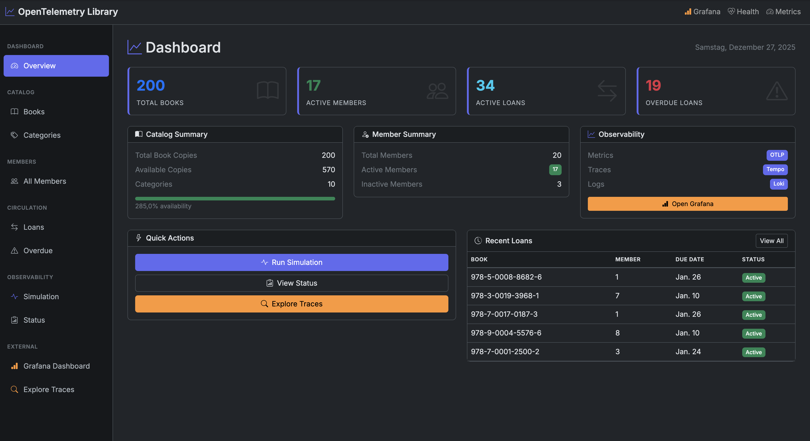
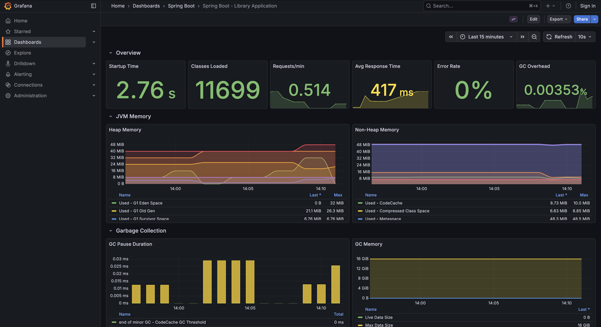
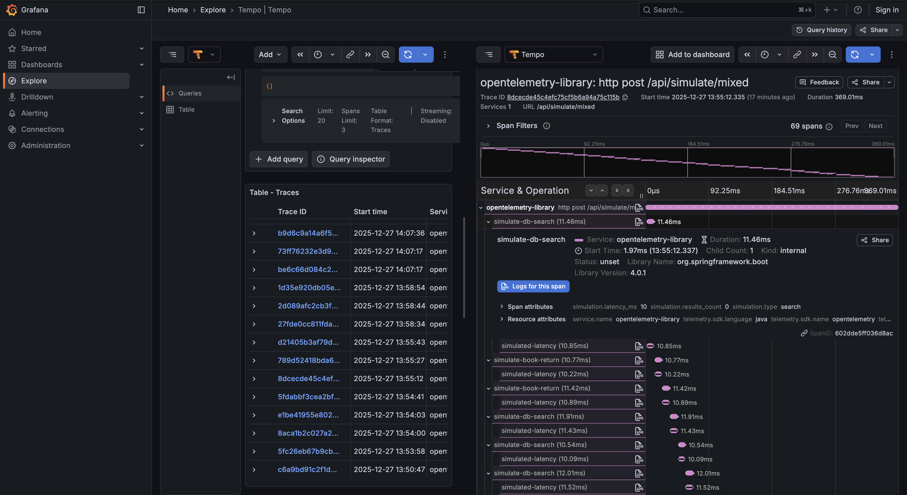
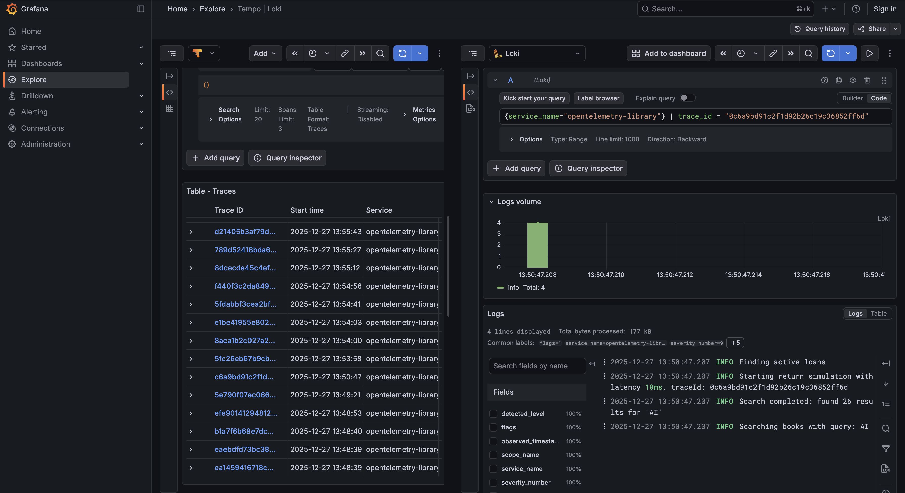

# OpenTelemetry Library Demo - Spring Boot 4.0.1

> **AI-Assisted Development**: This application was created using Claude Code with the Spring Documentation MCP Server. See [Prompts Used](#prompts-used) and [MCP Tools Used](#mcp-tools-used) sections at the end of this document.

A comprehensive Spring Boot 4.0.1 demo application showcasing OpenTelemetry features for observability. This demo uses a Book Library business context with mocked data to demonstrate metrics, tracing, and logging in a real-world scenario.

<table>
  <tr>
    <td align="center">
      <br/>
      <em>Demo Library App using OpenTelemetry</em>
    </td>
    <td align="center">
      <br/>
      <em>Spring Boot and Custom Metrics Dashboard</em>
    </td>
  </tr>
  <tr>
    <td align="center">
      <br/>
      <em>Tracing of call processing details</em>
    </td>
    <td align="center">
      <br/>
      <em>Connected Logs for traces</em>
    </td>
  </tr>
</table>

## Table of Contents

1. [Overview](#overview)
2. [Quick Start](#quick-start)
3. [OpenTelemetry Guide](#opentelemetry-guide)
4. [Grafana LGTM Stack](#grafana-lgtm-stack)
5. [Spring Boot 3.x vs 4.x Differences](#spring-boot-3x-vs-4x-differences)
6. [Custom Metrics](#custom-metrics)
7. [Distributed Tracing](#distributed-tracing)
8. [Structured Logging](#structured-logging)
9. [Testing with OpenTelemetry](#testing-with-opentelemetry)
10. [API Reference](#api-reference)
11. [Troubleshooting](#troubleshooting)
12. [Prompts Used](#prompts-used)
13. [MCP Tools Used](#mcp-tools-used)

---

## Overview

### What This Demo Shows

- **Spring Boot 4.0.1 OpenTelemetry Integration**: Native support for metrics, traces, and logs export
- **Grafana LGTM Stack**: Loki (logs), Grafana (visualization), Tempo (traces), Mimir (metrics)
- **Custom Business Metrics**: Using `@Observed` annotation and Micrometer
- **Distributed Tracing**: Cascaded spans through controller → service → simulated DB layers
- **Interactive Simulation**: Generate traces with configurable latency (10ms, 50ms, 500ms)

### Technology Stack

| Component | Version | Purpose |
|-----------|---------|---------|
| Java | 25 | Runtime |
| Spring Boot | 4.0.1 | Application Framework |
| spring-boot-starter-opentelemetry | 4.0.1 | OpenTelemetry auto-configuration |
| opentelemetry-logback-appender | 2.23.0-alpha | Log export to OTLP |
| Thymeleaf | 3.4+ | Server-side templating |
| Bootstrap | 5.3.3 | UI framework (dark theme) |
| Alpine.js | 3.x | Reactive UI components |
| Grafana LGTM | latest | Observability stack |

### Data Model

The demo generates mock data on startup:
- **200 Books** across 10 categories
- **10 Categories** (Fiction, Science Fiction, Mystery, etc.)
- **20 Members** with different membership types
- **~50 Active Loans** with some overdue

---

## Quick Start

### Prerequisites

- Java 25 (or compatible JDK)
- Docker and Docker Compose
- Gradle 9.2+ (included via wrapper)

### Running the Demo

```bash
# Navigate to the project directory
cd examples/operations/open-telemetry-library

# Start the application (Docker Compose will auto-start Grafana LGTM)
./gradlew bootRun
```

The application will be available at:

| Service | URL | Description |
|---------|-----|-------------|
| Application | http://localhost:8088 | Demo UI |
| Grafana | http://localhost:3000 | Dashboards & Explore |
| Actuator Health | http://localhost:8088/actuator/health | Health endpoint |
| Actuator Metrics | http://localhost:8088/actuator/metrics | Metrics list |
| Actuator Info | http://localhost:8088/actuator/info | Application info |

> **Note**: This demo uses OTLP (OpenTelemetry Protocol) to export metrics directly to Grafana's Mimir backend, not the Prometheus scrape model.

### Demo Workflow

1. Open the Application UI at http://localhost:8088
2. View the Dashboard with KPIs (Total Books, Active Members, etc.)
3. Navigate to the **Simulation** page
4. Select latency (e.g., 500ms) and request count (e.g., 10)
5. Click **Mixed Operations** to generate traces
6. Copy trace IDs and view in **Grafana Tempo**
7. Compare KPIs in the UI with **Grafana Mimir** metrics
8. View correlated logs in **Grafana Loki**

---

## OpenTelemetry Guide

### What is OpenTelemetry?

OpenTelemetry (OTel) is a vendor-neutral observability framework for generating, collecting, and exporting telemetry data (metrics, logs, and traces). Spring Boot 4.0.1 provides native support through the `spring-boot-starter-opentelemetry` starter.

### The Three Pillars of Observability

1. **Metrics**: Numerical measurements over time (request counts, latencies, gauges)
2. **Traces**: Request flow through distributed systems (spans, trace context)
3. **Logs**: Discrete events with trace correlation

### OTLP Protocol

OpenTelemetry Protocol (OTLP) is the standard for exporting telemetry:

```yaml
# application.yaml - Spring Boot 4.x configuration
management:
  tracing:
    sampling:
      probability: 1.0  # 100% sampling for demo
  # OTLP Metrics export
  otlp:
    metrics:
      export:
        url: http://localhost:4318/v1/metrics
  # OTLP Tracing and Logging export (Spring Boot 4.x property paths)
  opentelemetry:
    tracing:
      export:
        otlp:
          endpoint: http://localhost:4318/v1/traces
    logging:
      export:
        otlp:
          endpoint: http://localhost:4318/v1/logs

# OpenTelemetry resource attributes
otel:
  resource:
    attributes:
      service.name: opentelemetry-library
      service.version: 1.0.0
      deployment.environment: development
```

> **Important**: Spring Boot 4.x uses `management.opentelemetry.*` for traces and logs, while metrics still use `management.otlp.metrics.*`. See [Spring Boot 3.x vs 4.x Differences](#spring-boot-3x-vs-4x-differences) for details.

### Spring Boot 4.0.1 Configuration

The new `spring-boot-starter-opentelemetry` provides:
- Auto-configuration for traces, metrics, and logs
- Integration with Micrometer for metrics
- Support for `@Observed` annotation
- OTLP export out of the box

```groovy
dependencies {
    implementation 'org.springframework.boot:spring-boot-starter-opentelemetry'
    implementation 'io.opentelemetry.instrumentation:opentelemetry-logback-appender-1.0:2.23.0-alpha'
}
```

---

## Grafana LGTM Stack

### What is LGTM?

LGTM is Grafana's open-source observability stack:

- **L**oki: Log aggregation system
- **G**rafana: Visualization and dashboarding
- **T**empo: Distributed tracing backend
- **M**imir: Long-term metrics storage

### Docker Setup

```yaml
# compose.yaml
services:
  grafana-lgtm:
    image: 'grafana/otel-lgtm:latest'
    ports:
      - '3000:3000'    # Grafana UI
      - '4317:4317'    # OTLP gRPC
      - '4318:4318'    # OTLP HTTP
    environment:
      - GF_AUTH_ANONYMOUS_ENABLED=true
      - GF_AUTH_ANONYMOUS_ORG_ROLE=Admin
    volumes:
      # Mount custom dashboard for auto-provisioning
      - ./grafana/provisioning/dashboards/spring-boot-dashboard.json:/otel-lgtm/spring-boot-dashboard.json:ro
      - ./grafana/provisioning/dashboards/dashboard.yaml:/otel-lgtm/grafana/conf/provisioning/dashboards/spring-boot-dashboards.yaml:ro
    labels:
      # Required for Spring Boot Docker Compose integration
      org.springframework.boot.service-connection: otel-collector
```

> **Important**: The `org.springframework.boot.service-connection: otel-collector` label enables Spring Boot's Docker Compose integration to auto-configure the OTLP endpoints when using `spring-boot-docker-compose`.

### Pre-configured Dashboard

A custom "Spring Boot - Library Application" dashboard is automatically provisioned when the container starts. It includes:

**Overview Row:**
- Startup Time, Classes Loaded, Requests/min, Avg Response Time, Error Rate, GC Overhead

**JVM Memory Row:**
- Heap Memory (G1 Eden, Old Gen, Survivor)
- Non-Heap Memory (Metaspace, CodeCache, Compressed Class Space)

**Garbage Collection Row:**
- GC Pause Duration, GC Memory (Live Data Size, Max Data Size, Allocation Rate)

**HTTP Requests Row:**
- Request Rate by Endpoint, Response Time by Endpoint, Request Outcomes

**Library Custom Metrics Row:**
- Total Books, Available Books, Total Members, Active Members, Active Loans, Overdue Loans
- Library Operations graph (Book Searches, Loans Created, Loans Returned)

The dashboard uses Micrometer-style metric names (e.g., `jvm_memory_used_bytes`) exported by Spring Boot, not OpenTelemetry semantic convention names.

**Dashboard files:**
```
grafana/provisioning/dashboards/
├── dashboard.yaml                  # Provisioning configuration
└── spring-boot-dashboard.json      # Dashboard definition
```

### Accessing Grafana

1. Open http://localhost:3000
2. Default credentials: admin/admin (anonymous access enabled)
3. Pre-configured data sources: Loki, Tempo, Prometheus (Mimir backend)
4. Navigate to **Dashboards** → **Spring Boot** → **Spring Boot - Library Application**

### Viewing Metrics (Prometheus/Mimir)

Navigate to **Explore** → Select **Prometheus** data source:

```promql
# Total books
library_books_total{application="opentelemetry-library"}

# Book searches over time
rate(library_books_searches_total[5m])

# Active loans
library_loans_active{application="opentelemetry-library"}
```

### Viewing Traces (Tempo)

Navigate to **Explore** → Select **Tempo** data source:

1. **Use "Search" mode** (recommended): Click the "Search" tab to browse available traces
2. Filter by service name: `opentelemetry-library`
3. Click on a trace to see the full span hierarchy

Alternatively, use TraceQL queries:
```
{ resource.service.name = "opentelemetry-library" }
```

> **Tip**: If TraceQL shows "No data", switch to the "Search" query type which provides a more user-friendly interface for browsing traces.

### Viewing Logs (Loki)

Navigate to **Explore** → Select **Loki** data source:

```logql
# All application logs (use service_name label)
{service_name="opentelemetry-library"}

# Filter by log level
{service_name="opentelemetry-library"} | detected_level="info"

# Search for specific text
{service_name="opentelemetry-library"} |= "Started LibraryApplication"

# Logs with specific trace ID
{service_name="opentelemetry-library"} | trace_id="abc123def456"
```

> **Note**: The OTLP logs use `service_name` as the label, not `job`. Common labels include `telemetry_sdk_language=java` and `telemetry_sdk_name=opentelemetry`.

---

## Spring Boot 3.x vs 4.x Differences

Spring Boot 4.x introduces significant changes to OpenTelemetry configuration. This section documents the key differences for developers migrating from Spring Boot 3.x.

### Property Path Changes

| Signal | Spring Boot 3.x | Spring Boot 4.x |
|--------|-----------------|-----------------|
| **Traces** | `management.otlp.tracing.endpoint` | `management.opentelemetry.tracing.export.otlp.endpoint` |
| **Logs** | `management.otlp.logging.endpoint` | `management.opentelemetry.logging.export.otlp.endpoint` |
| **Metrics** | `management.otlp.metrics.export.url` | `management.otlp.metrics.export.url` (unchanged) |

### Complete Configuration Comparison

**Spring Boot 3.x (deprecated paths):**
```yaml
management:
  otlp:
    tracing:
      endpoint: http://localhost:4318/v1/traces
    logging:
      endpoint: http://localhost:4318/v1/logs
    metrics:
      export:
        url: http://localhost:4318/v1/metrics
```

**Spring Boot 4.x (current paths):**
```yaml
management:
  otlp:
    metrics:
      export:
        url: http://localhost:4318/v1/metrics
  opentelemetry:
    tracing:
      export:
        otlp:
          endpoint: http://localhost:4318/v1/traces
    logging:
      export:
        otlp:
          endpoint: http://localhost:4318/v1/logs
```

### Dependency Changes

**Spring Boot 3.x:**
```groovy
dependencies {
    implementation 'org.springframework.boot:spring-boot-starter-actuator'
    implementation 'io.micrometer:micrometer-tracing-bridge-otel'
    implementation 'io.opentelemetry:opentelemetry-exporter-otlp'
}
```

**Spring Boot 4.x:**
```groovy
dependencies {
    implementation 'org.springframework.boot:spring-boot-starter-opentelemetry'
    implementation 'io.opentelemetry.instrumentation:opentelemetry-logback-appender-1.0:2.23.0-alpha'
}
```

The new `spring-boot-starter-opentelemetry` starter bundles all necessary dependencies for traces, metrics, and logs export.

### Docker Compose Service Connection

Spring Boot 4.x with `spring-boot-docker-compose` supports automatic OTLP endpoint configuration using service labels:

```yaml
services:
  grafana-lgtm:
    image: 'grafana/otel-lgtm:latest'
    labels:
      org.springframework.boot.service-connection: otel-collector
```

This label tells Spring Boot to auto-configure the OTLP endpoints based on the container's exposed ports.

### Key Migration Notes

1. **Traces and Logs property paths changed**: The `management.otlp.tracing.*` and `management.otlp.logging.*` paths are now under `management.opentelemetry.*`

2. **Metrics path unchanged**: The metrics configuration remains at `management.otlp.metrics.export.url`

3. **New starter dependency**: Replace individual OTel dependencies with `spring-boot-starter-opentelemetry`

4. **Logback appender still required**: For log export, you still need `opentelemetry-logback-appender-1.0` and the `InstallOpenTelemetryAppender` component

5. **Resource attributes**: Use `otel.resource.attributes.*` for service name, version, and environment tags

---

## Custom Metrics

### Using @Observed Annotation

The `@Observed` annotation automatically creates metrics and spans:

```java
@Service
public class BookService {

    @Observed(name = "library.book.search",
              contextualName = "search-books")
    public List<Book> search(String query) {
        log.info("Searching books with query: {}", query);
        return dataInitializer.getBooks().values().stream()
            .filter(book -> matchesQuery(book, query))
            .toList();
    }
}
```

This creates:
- A timer metric: `library.book.search`
- A span in traces: `search-books`

### Micrometer Counters and Gauges

For custom business metrics, use Micrometer directly:

```java
@Component
public class LibraryMetrics {
    private final Counter bookSearchCounter;
    private final AtomicInteger activeLoansGauge;

    public LibraryMetrics(MeterRegistry registry) {
        this.bookSearchCounter = Counter.builder("library.books.searches")
            .description("Number of book searches")
            .register(registry);

        this.activeLoansGauge = registry.gauge("library.loans.active",
            new AtomicInteger(0));
    }

    public void recordBookSearch() {
        bookSearchCounter.increment();
    }

    public void updateActiveLoans(int count) {
        activeLoansGauge.set(count);
    }
}
```

### Metric Naming Best Practices

- Use lowercase with dots as separators: `library.books.total`
- Include the domain prefix: `library.`
- Use descriptive names: `library.loans.overdue` not `overdue_count`
- Add tags for dimensions: `library.loans.active{type="standard"}`

### Available Metrics

| Metric Name | Type | Description |
|-------------|------|-------------|
| `library.books.total` | Gauge | Total books in system |
| `library.books.available` | Gauge | Available book copies |
| `library.books.searches` | Counter | Book search operations |
| `library.members.total` | Gauge | Total members |
| `library.members.active` | Gauge | Active members |
| `library.loans.active` | Gauge | Currently active loans |
| `library.loans.overdue` | Gauge | Overdue loans |
| `library.loans.created` | Counter | Loans created |
| `library.loans.returned` | Counter | Loans returned |

---

## Distributed Tracing

### Understanding Traces

A **trace** represents a single request's journey through your system. It consists of multiple **spans**:

```
HTTP POST /api/simulate/loan (traceId: abc123)
└── LoanController.simulateLoan (spanId: 001)
    ├── MemberService.findById (spanId: 002)
    ├── BookService.findByIsbn (spanId: 003)
    └── LoanService.createLoan (spanId: 004)
        └── simulated-db-call (spanId: 005)
```

### Automatic Instrumentation

Spring Boot 4.0.1 automatically instruments:
- HTTP requests/responses
- JDBC queries
- RestTemplate/WebClient calls
- Spring MVC controllers

### Creating Custom Spans

Use the OpenTelemetry Tracer API for custom spans:

```java
@Service
public class SimulationService {
    private final Tracer tracer;

    public SimulationResult simulateSearch(int latencyMs) {
        Span span = tracer.spanBuilder("simulate-db-search").startSpan();
        try (Scope scope = span.makeCurrent()) {
            // Add custom attributes
            span.setAttribute("simulation.type", "search");
            span.setAttribute("simulation.latency_ms", latencyMs);

            // Simulate work
            Thread.sleep(latencyMs);

            return performSearch();
        } finally {
            span.end();
        }
    }
}
```

### Adding Span Attributes

Attributes provide context about operations:

```java
span.setAttribute("db.system", "postgresql");
span.setAttribute("db.operation", "SELECT");
span.setAttribute("db.table", "books");
span.setAttribute("library.book.isbn", isbn);
span.setAttribute("library.member.id", memberId);
```

### Trace Context Propagation

Trace context is automatically propagated across HTTP calls. The current trace ID is available in logs:

```java
String traceId = Span.current().getSpanContext().getTraceId();
log.info("Processing request, traceId: {}", traceId);
```

---

## Structured Logging

### OpenTelemetry Logback Appender

Configure log export in `logback-spring.xml`:

```xml
<?xml version="1.0" encoding="UTF-8"?>
<configuration>
    <include resource="org/springframework/boot/logging/logback/base.xml"/>

    <appender name="OTEL"
              class="io.opentelemetry.instrumentation.logback.appender.v1_0.OpenTelemetryAppender">
    </appender>

    <root level="INFO">
        <appender-ref ref="CONSOLE"/>
        <appender-ref ref="OTEL"/>
    </root>
</configuration>
```

### Installing the Appender

The appender needs to be installed after Spring context initialization:

```java
@Component
class InstallOpenTelemetryAppender implements InitializingBean {
    private final OpenTelemetry openTelemetry;

    @Override
    public void afterPropertiesSet() {
        OpenTelemetryAppender.install(this.openTelemetry);
    }
}
```

### Trace Correlation

Logs are automatically correlated with traces. Use structured logging:

```java
log.info("Created loan {} for book {} and member {}",
    loan.id(), bookIsbn, memberId);
```

In Grafana Loki, query by trace ID:
```logql
{job="opentelemetry-library"} |= "traceId=abc123"
```

### Log Levels Best Practices

| Level | Use Case |
|-------|----------|
| DEBUG | Detailed debugging information |
| INFO | Normal operations, business events |
| WARN | Unexpected situations, not errors |
| ERROR | Failures requiring attention |

---

## Testing with OpenTelemetry

### Test Dependencies

```groovy
testImplementation 'org.springframework.boot:spring-boot-starter-test'
testImplementation 'org.springframework.boot:spring-boot-starter-opentelemetry-test'
```

### Testing Services

```java
@SpringBootTest
class ObservabilityTests {
    @Autowired
    private Tracer tracer;

    @Autowired
    private MeterRegistry meterRegistry;

    @Test
    void tracerIsConfigured() {
        assertThat(tracer).isNotNull();
    }

    @Test
    void customMetricsAreRegistered() {
        var libraryMeters = meterRegistry.getMeters().stream()
            .filter(m -> m.getId().getName().startsWith("library."))
            .toList();
        assertThat(libraryMeters).isNotEmpty();
    }
}
```

### Testing Simulation

```java
@Autowired
private SimulationService simulationService;

@Test
void simulationCreatesTraceIds() {
    var result = simulationService.simulateSearch(10);
    assertThat(result.traceId()).isNotEmpty();
    assertThat(result.operation()).isEqualTo("search");
}
```

---

## API Reference

### REST Endpoints

| Method | Endpoint | Description |
|--------|----------|-------------|
| GET | `/api/books` | List all books |
| GET | `/api/books/{isbn}` | Get book by ISBN |
| GET | `/api/books/search?query=` | Search books |
| GET | `/api/members` | List all members |
| GET | `/api/members/{id}` | Get member by ID |
| GET | `/api/loans` | List all loans |
| POST | `/api/loans` | Create a loan |
| PUT | `/api/loans/{id}/return` | Return a loan |

### Simulation Endpoints

| Method | Endpoint | Parameters | Description |
|--------|----------|------------|-------------|
| POST | `/api/simulate/search` | count, latencyMs | Simulate searches |
| POST | `/api/simulate/loan` | count, latencyMs | Simulate loans |
| POST | `/api/simulate/return` | count, latencyMs | Simulate returns |
| POST | `/api/simulate/mixed` | count, latencyMs | Mixed operations |

Example:
```bash
curl -X POST "http://localhost:8088/api/simulate/mixed?count=10&latencyMs=500"
```

### UI Pages

| Page | URL | Description |
|------|-----|-------------|
| Dashboard | `/` | KPIs and overview |
| Books | `/books` | Book catalog |
| Members | `/members` | Member list |
| Loans | `/loans` | All loans |
| Overdue | `/loans/overdue` | Overdue loans |
| Simulation | `/simulation` | Trace generation |
| Status | `/status` | System status |

---

## Troubleshooting

### Metrics Not Appearing in Grafana

1. **Use Prometheus data source, not Mimir**: In Grafana Explore, select "Prometheus" as the data source (not "mimir")

2. **Click "Metrics browser"**: Open the Metrics browser to see available metrics. You should see metrics like:
   - `application_ready_time_milliseconds`
   - `http_server_requests_milliseconds_*`
   - `jvm_buffer_*`

3. **Verify Spring Boot 4.x configuration** (common mistake):
   ```yaml
   # CORRECT for Spring Boot 4.x
   management:
     otlp:
       metrics:
         export:
           url: http://localhost:4318/v1/metrics
   ```

4. **Check labels**: Metrics should have labels like `service_name`, `application`, `telemetry_sdk_language=java`

### Traces Not Appearing in Tempo

1. **Use "Search" query type, not "TraceQL"**: In Grafana Tempo, if TraceQL shows "No data", switch to the "Search" tab to browse traces

2. **Verify Spring Boot 4.x property path** (common mistake):
   ```yaml
   # WRONG for Spring Boot 4.x
   management:
     otlp:
       tracing:
         endpoint: http://localhost:4318/v1/traces

   # CORRECT for Spring Boot 4.x
   management:
     opentelemetry:
       tracing:
         export:
           otlp:
             endpoint: http://localhost:4318/v1/traces
   ```

3. **Verify sampling is enabled**:
   ```yaml
   management:
     tracing:
       sampling:
         probability: 1.0  # 100% sampling for demo
   ```

4. **Generate some traffic**: Run a simulation or curl a few endpoints to create traces

### Logs Not Appearing in Loki

1. **Verify Spring Boot 4.x property path** (common mistake):
   ```yaml
   # CORRECT for Spring Boot 4.x
   management:
     opentelemetry:
       logging:
         export:
           otlp:
             endpoint: http://localhost:4318/v1/logs
   ```

2. **Use correct LogQL query**:
   ```logql
   {service_name="opentelemetry-library"}
   ```

3. **Verify `InstallOpenTelemetryAppender` is a Spring component**:
   ```java
   @Component
   class InstallOpenTelemetryAppender implements InitializingBean {
       // ...
   }
   ```

4. **Check `logback-spring.xml`** includes the OTEL appender

### Logs Not Correlating with Traces

1. Check logs have `trace_id` and `span_id` fields in Loki
2. Ensure the Logback appender is installed after Spring context loads
3. Query Loki with the specific trace ID:
   ```logql
   {service_name="opentelemetry-library"} | trace_id="your-trace-id"
   ```

### Docker Compose Issues

1. **Restart containers after config changes**:
   ```bash
   docker-compose down
   docker-compose up -d
   ```

2. **Verify service connection label** is present in `compose.yaml`:
   ```yaml
   labels:
     org.springframework.boot.service-connection: otel-collector
   ```

3. **Clean rebuild**:
   ```bash
   docker-compose down -v
   ./gradlew bootRun
   ```

4. **Check container logs**:
   ```bash
   docker-compose logs grafana-lgtm
   ```

### Common Spring Boot 4.x Migration Issues

| Symptom | Cause | Solution |
|---------|-------|----------|
| Traces not exported | Wrong property path | Use `management.opentelemetry.tracing.export.otlp.endpoint` |
| Logs not exported | Wrong property path | Use `management.opentelemetry.logging.export.otlp.endpoint` |
| No data in Tempo | Using TraceQL mode | Switch to "Search" query type |
| Service name wrong | Missing resource attributes | Add `otel.resource.attributes.service.name` |

---

## Prompts Used

> The following prompts were used during AI-assisted development:

### Prompt 1: Initial Planning

```
Create a demo using Spring Boot 4.0.1 and the new OpenTelemetry features for
Logging, Tracing, Metrics Dashboard. Use the concept from playground/ot/ as base
and its compose.yml for Grafana LGTM stack. Goals:
- Book Library context with mocked data (200 books, 10 categories, 20 members)
- Thymeleaf dark theme UI (like lms-modulith-openapi)
- Simulation buttons for trace testing (10ms, 50ms, 500ms latency)
- Custom metrics with @Observable
- KPI status page for verification
```

### Prompt 2: Documentation Phases

```
Before we start to implement add the following todo's to the planning document:
- Phase 9: Comprehensive README documentation covering OpenTelemetry, Grafana LGTM,
  custom metrics, tracing, logging, and testing
- Phase 10: Spring MCP Server usage tracking (similar to lms-modulith-openapi README)
```

### Prompt 3: Implementation

```
Start implementation
```

---

## MCP Tools Used

> The following Spring MCP Server tools were used during development:

| Tool | Purpose |
|------|---------|
| `listSpringBootVersions` | Verified Spring Boot 4.0.1 availability |
| `getBreakingChanges` | Retrieved Spring Boot 4.0 breaking changes |
| `initializrSearchDependencies` | Found opentelemetry dependencies |
| `getSpringBootLanguageRequirements` | Confirmed Java 25 compatibility |
| `searchSpringDocs` | Searched OpenTelemetry documentation |
| `getClassDoc` | Looked up Tracer and Span APIs |

---

## Development Notes

### Key Decisions

1. **In-Memory Data Store**: Used `ConcurrentHashMap` for thread-safe mock data storage
2. **Tracer API**: Used OpenTelemetry Tracer for custom spans in simulation
3. **Logback Integration**: Required `InstallOpenTelemetryAppender` component for log export
4. **Port 8088**: Application runs on 8088 to avoid conflicts with other services

### Learnings

1. Spring Boot 4.0.1 requires `spring-boot-starter-opentelemetry` (new starter)
2. The Logback appender needs manual installation after Spring context loads
3. All service methods use `@Observed` for automatic metrics and tracing
4. Gradle 9.2+ is required for Java 25 compatibility

### File Structure

```
open-telemetry-library/
├── compose.yaml                      # Docker Compose for Grafana LGTM
├── grafana/
│   └── provisioning/
│       └── dashboards/
│           ├── dashboard.yaml        # Dashboard provisioning config
│           └── spring-boot-dashboard.json  # Custom Grafana dashboard
└── src/main/java/com/example/library/
    ├── LibraryApplication.java       # Main application entry point
    ├── config/
    │   └── OpenTelemetryConfig.java  # OTel appender installation
    ├── controller/
    │   ├── BookController.java       # Books REST API
    │   ├── CategoryController.java   # Categories REST API
    │   ├── LoanController.java       # Loans REST API
    │   ├── MemberController.java     # Members REST API
    │   ├── SimulationController.java # Simulation API
    │   └── WebController.java        # Thymeleaf UI controller
    ├── data/
    │   └── DataInitializer.java      # Mock data generation
    ├── metrics/
    │   └── LibraryMetrics.java       # Custom Micrometer metrics
    ├── model/
    │   ├── Book.java
    │   ├── Category.java
    │   ├── Loan.java
    │   ├── Member.java
    │   └── MembershipType.java
    └── service/
        ├── BookService.java
        ├── CategoryService.java
        ├── LoanService.java
        ├── MemberService.java
        └── SimulationService.java
```

---

## License

This demo is part of the Spring MCP Server examples and is available for educational purposes.
